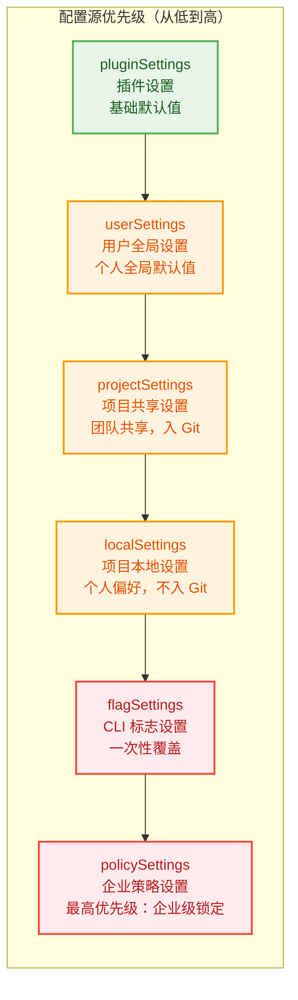
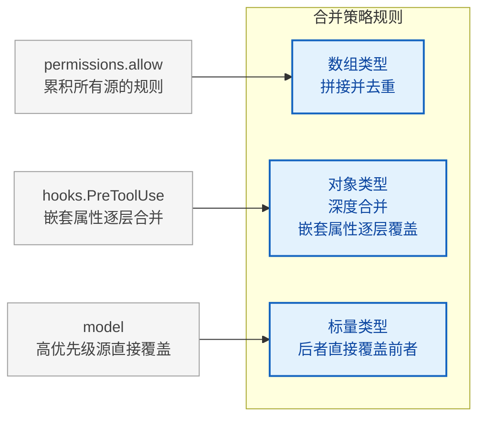
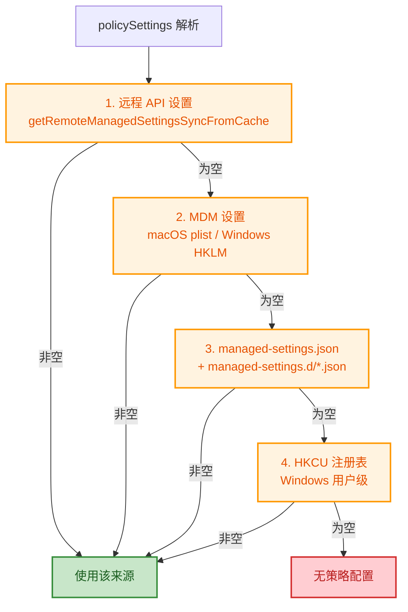
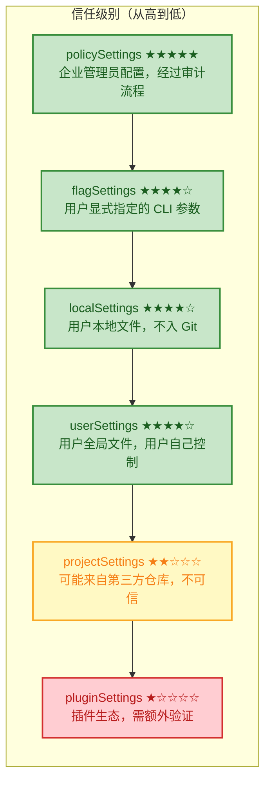
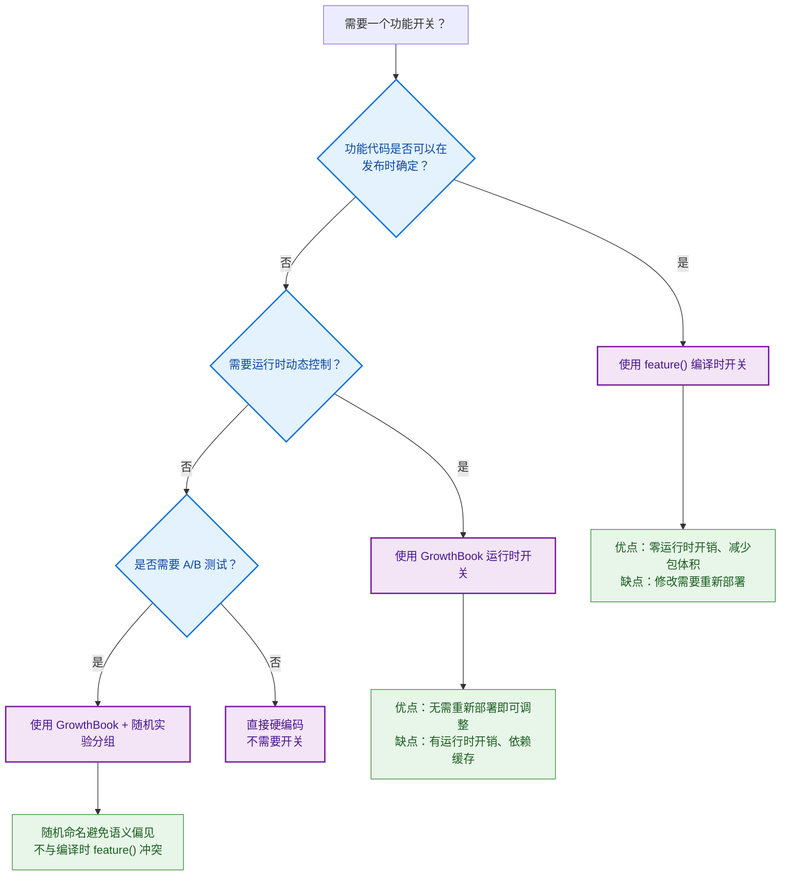
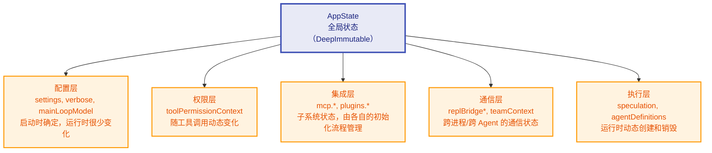

# 第5章：设置与配置 -- Agent 的基因

> **学习目标：** 理解六层配置源的合并规则和安全边界，掌握功能开关系统的编译时优化机制，以及 Zustand-like 不可变状态存储的设计哲学。通过本章的学习，你将能够为不同规模的团队设计合理的配置策略，并理解配置系统如何成为 Agent 安全防护的第一道防线。

---

Claude Code 的行为不是由某个单一配置文件决定的，而是由六层配置源逐层合并而成。这些配置源就像 Agent 的"基因"——它们在 Agent 启动前就已写定，决定了 Agent 能做什么、不能做什么、以及以何种方式去做。理解这套体系，是驾驭 Claude Code 行为定制能力的第一步。

将配置系统比作"基因"是恰当的：正如生物体的基因在受精卵形成时就已确定，并在发育过程中逐层表达，Claude Code 的配置也在启动时加载，在运行时逐层生效。不同的是，Agent 的"基因"可以被精准地编辑和覆盖——这既是强大的能力，也带来了安全挑战。

## 5.1 六层配置源的优先级体系

### 5.1.1 配置源定义与顺序

Claude Code 的配置源在配置常量模块中定义为一个有序数组，包含五种配置来源：用户全局设置（userSettings）、项目共享设置（projectSettings）、项目本地设置（localSettings，gitignored）、CLI 标志设置（flagSettings）和企业策略设置（policySettings）。

配置加载函数 `loadSettingsFromDisk()` 遵循一个关键原则：**后加载者覆盖前者**。合并并非简单的全量替换，而是使用深度合并策略配合自定义规则。

实际执行时还有一个隐藏的最低优先级层：**pluginSettings**（插件设置）。在配置加载流程中，插件设置首先被加载为合并的基础，后续各层配置在此基础上依次叠加。

因此，完整的优先级链从低到高是：

**pluginSettings -> userSettings -> projectSettings -> localSettings -> flagSettings -> policySettings**

为了更直观地理解这六层配置源的关系，我们可以用一个类似"地层沉积"的模型来类比：



> 每一层都可以覆盖下层的配置，但不会删除下层配置——它们只是被"遮盖"了。这种设计确保了每一层都可以独立理解和维护。

### 5.1.2 合并规则



合并的核心在自定义合并策略函数 `settingsMergeCustomizer` 中：该函数对数组类型执行拼接并去重操作，其他类型则交给默认的深度合并逻辑处理。

这套规则的关键特性是：

- **数组类型**：拼接并去重（而非替换）。例如 `permissions.allow` 字段会累积所有源的规则。
- **对象类型**：深度合并。嵌套属性逐层覆盖。
- **标量类型**：后者直接覆盖前者。

这意味着，如果 `userSettings` 设置了 `model: "claude-sonnet-4"`，而 `policySettings` 设置了 `model: "claude-opus-4"`，最终生效的是 `"claude-opus-4"`。但如果两者都设置了 `permissions.allow: ["Bash(*)"]`，最终结果是合并后的去重数组。

**为什么数组采用拼接而非替换？** 这是一个经过深思熟虑的设计决策。在权限系统中，每一条规则都是一道"防线"——如果高优先级源的数组替换了低优先级源的数组，就意味着高优先级源必须完整枚举所有需要的权限规则，任何遗漏都会变成安全漏洞。拼接策略让每层只需要关心自己要"增加"的规则，系统会自动合并所有层的安全策略。

反模式警告：不要利用数组拼接来"撤销"下层的规则。例如，你不能通过在上层设置一个空数组来清除下层的权限——空数组拼接后下层规则依然存在。如果需要撤销，应该使用 `permissions.deny` 字段来显式拒绝。

让我们通过一个完整的例子来演示合并过程：

```
场景：一个前端团队的项目配置

// ~/.claude/settings.json (userSettings - 开发者小张的个人全局设置)
{
  "model": "claude-sonnet-4",
  "permissions": {
    "allow": ["Bash(npm *)", "Bash(node *)"]
  },
  "verbose": true
}

// .claude/settings.json (projectSettings - 团队共享设置，提交到 Git)
{
  "permissions": {
    "allow": ["Bash(npm run lint)", "Bash(npm test)", "Read(*)"]
  },
  "hooks": {
    "PreToolUse": [{ "matcher": "Bash(*)", "hooks": [{ "type": "command", "command": "audit-log.sh" }] }]
  }
}

// .claude/settings.local.json (localSettings - 小张的本地覆盖)
{
  "model": "claude-opus-4",
  "permissions": {
    "allow": ["Bash(git *)"]
  }
}

合并结果：
{
  "model": "claude-opus-4",          // localSettings 覆盖 userSettings
  "verbose": true,                    // 仅 userSettings 设置，保持不变
  "permissions": {
    "allow": [
      "Bash(npm *)",                  // 来自 userSettings
      "Bash(node *)",                 // 来自 userSettings
      "Bash(npm run lint)",           // 来自 projectSettings
      "Bash(npm test)",              // 来自 projectSettings
      "Read(*)",                      // 来自 projectSettings
      "Bash(git *)"                   // 来自 localSettings
    ]                                  // 数组拼接去重
  },
  "hooks": {
    "PreToolUse": [{ ... }]           // 仅 projectSettings 设置
  }
}
```

### 5.1.3 配置文件的实际路径

每个配置源对应一个具体的文件路径，由配置路径映射函数确定：

| 配置源 | 文件路径 | 说明 | 是否入 Git |
|--------|----------|------|-----------|
| userSettings | `~/.claude/settings.json` | 全局用户设置 | N/A（用户目录） |
| projectSettings | `<project>/.claude/settings.json` | 项目共享设置（提交到 Git） | 是 |
| localSettings | `<project>/.claude/settings.local.json` | 项目本地设置（加入 .gitignore） | 否 |
| flagSettings | CLI `--settings` 参数指定路径 | 一次性覆盖 | N/A |
| policySettings | 平台相关的 managed-settings.json | 企业管理 | N/A |

其中 `policySettings` 的解析最为复杂。它遵循 **"first source wins"**（第一个非空源胜出）策略，优先级从高到低为：



注意 policySettings 使用的是"首个非空源胜出"而非"深度合并"。这个差异至关重要：企业管理策略通常是一个完整的、经过审计的配置方案，不同来源的策略之间不应该互相"渗透"。例如，远程 API 下发的策略已经包含了完整的安全规则，不应该被本地的 managed-settings.json 文件中的部分配置所稀释。

### 5.1.4 策略层的特殊地位

与其他配置源使用深度合并不同，`policySettings` 采用了完全不同的解析逻辑。它不是从文件读取后合并，而是按优先级查找第一个非空源（远程 API 设置 > MDM 设置 > managed-settings.json 文件 > HKCU 注册表）。

这意味着企业管理员只需在一个位置配置策略，系统就会使用最高优先级的那个来源，而非合并所有来源。

**设计决策分析：为什么 policySettings 的合并逻辑与其他配置源不同？**

这源于两种不同的信任模型。userSettings 到 flagSettings 的五层配置遵循"增量累积"模型——每一层都是在信任下层的基础上叠加自己的偏好。而 policySettings 遵循"权威单一"模型——企业策略是从一个权威来源完整下发的，不同来源之间的合并会引入不可预测的行为。

试想如果两个 MDM 系统分别下发了不同的 model 限制和 permissions 规则，合并后可能出现语义冲突：一个限制了可用的模型列表，另一个限制了权限范围，但合并结果可能让用户使用受限模型绕过权限限制。"首个非空源胜出"策略确保了策略来源的确定性和可审计性。

### 5.1.5 配置加载的真实项目实践

在实际项目中，六层配置体系的合理使用可以极大地提升团队协作效率和安全性。以下是几种常见的配置策略模式：

**模式一：个人-团队分离**

这是最常见的模式。开发者将个人偏好放在 `userSettings` 和 `localSettings` 中，将团队共享的规则放在 `projectSettings` 中：

```
~/.claude/settings.json      → 个人模型偏好、个人常用的权限规则
.claude/settings.json         → 团队统一的 lint 规则、权限基线、共享 hooks
.claude/settings.local.json   → 个人覆盖（调试模式、特殊权限）
```

**模式二：CI/CD 专用配置**

在自动化流水线中，使用 `flagSettings` 通过 CLI 参数注入一次性配置，避免修改任何持久化的配置文件：

```
claude --settings /path/to/ci-settings.json
```

这种方式确保 CI 环境的配置是临时的、可追溯的，不会污染开发者的本地环境。

**模式三：企业统一管控**

大型组织通过 MDM 或远程 API 统一下发 policySettings，锁定安全相关的配置项（允许的工具、hooks 白名单等），同时允许团队在 projectSettings 中定制非安全相关的行为：

```
policySettings    → 锁定: model、permissions.deny、allowManagedHooksOnly
projectSettings   → 定制: hooks（非安全类）、MCP 服务器配置
userSettings      → 个性化: verbose、主题等 UI 偏好
```

## 5.2 安全边界设计

配置系统的核心安全挑战是：`projectSettings`（`.claude/settings.json`）会被提交到 Git 仓库，这意味着克隆恶意仓库的用户可能在不知情的情况下加载攻击者的配置。Claude Code 的防护策略是：**在安全敏感的检查中，系统性地排除 `projectSettings`**。

这就像一栋大楼的权限系统：项目的门禁卡可以打开会议室和休息区（projectSettings），但绝不能打开机房和安全室（安全敏感操作）。不同级别的权限由不同的信任级别控制。

### 5.2.1 供应链攻击的威胁模型

在理解安全边界设计之前，我们需要明确威胁模型。供应链攻击在 Agent 场景下的特殊性在于：

**传统供应链攻击 vs Agent 供应链攻击**

| 维度 | 传统软件供应链 | Agent 配置供应链 |
|------|--------------|-----------------|
| 攻击向量 | 恶意依赖包、篡改的构建产物 | 恶意配置文件、hooks 注入 |
| 受害者 | 运行软件的系统 | 使用 Agent 的开发者 |
| 攻击面 | 构建管道、运行时环境 | 文件系统、代码执行、数据访问 |
| 隐蔽性 | 中等（需要绕过安全检测） | 极高（配置文件看似正常） |
| 影响范围 | 软件用户 | 开发者的整个工作环境 |

一个具体的攻击场景：攻击者创建一个看似正常的开源项目，在 `.claude/settings.json` 中配置一个 `PreToolUse` hook，该 hook 在每次工具调用时将用户的敏感信息（API key、环境变量）发送到攻击者的服务器。当开发者克隆该项目并启动 Claude Code 时，恶意 hook 就会在不知情的情况下执行。

**为什么 projectSettings 是风险最大的配置源？**

与其他配置源不同，projectSettings 有三个独特属性使其成为主要的风险点：

1. **来源不可信**：projectSettings 来自克隆的第三方仓库，而非用户自己编写
2. **自动加载**：进入项目目录后配置自动生效，无需用户确认
3. **可执行代码**：hooks 配置可以执行任意 shell 命令

userSettings 和 localSettings 不具备第一个属性（它们在用户自己的文件系统上），flagSettings 需要用户显式指定（不具备第二个属性），policySettings 由管理员控制（不具备第一个属性）。因此，projectSettings 是唯一同时具备三个高风险属性的配置源。

### 5.2.2 shouldAllowManagedHooksOnly

在钩子配置快照模块中，`shouldAllowManagedHooksOnly` 函数决定了是否只允许托管（managed）hooks 运行。它会检查策略设置中是否启用了 `allowManagedHooksOnly`，如果启用了则返回 true。

当此函数返回 `true` 时，hooks 的执行只使用来自 `policySettings` 的 hooks，所有来自 user/project/local 的 hooks 被跳过。这是一个企业安全特性：管理员可以确保只有经过审核的 hooks 在组织内运行。

**实战场景：金融机构的合规要求**

假设一家金融机构要求所有代码变更必须经过内部审计系统记录。管理员可以在 managed-settings.json 中配置：

- 设置 `allowManagedHooksOnly: true`，阻止所有非托管的 hooks
- 在 policySettings 的 hooks 中配置审计日志 hook
- 这样无论开发者本地的 projectSettings 中有什么 hooks，只有管理员审计 hook 会运行

这种"仅托管"模式确保了组织内的 hooks 执行是可预测的、可审计的——开发者无法通过修改本地配置来绕过审计。

### 5.2.3 pluginOnlyPolicy

插件策略模块实现了 `strictPluginOnlyCustomization` 策略，它定义了四种可锁定的"定制面"（customization surfaces）：skills、agents、hooks、mcp。

核心判断函数 `isRestrictedToPluginOnly` 检查策略配置：如果策略为 `true`，则锁定所有面；如果策略是数组，则只锁定指定的面。

被锁定的面中，只有以下来源被信任：

- **plugin** -- 通过 `strictKnownMarketplaces` 单独管控
- **policySettings** -- 由管理员设置，天然可信
- **built-in / bundled** -- 随 CLI 发布，非用户编写

而用户级别（`~/.claude/*`）和项目级别（`.claude/*`）的定制全部被阻断。

这个设计的精妙之处在于"选择性锁定"。企业管理员不需要一刀切地禁止所有定制，而是可以精细地控制哪些定制面需要锁定。例如：

- 锁定 `mcp`：阻止开发者连接未批准的 MCP 服务器（防止数据泄露）
- 锁定 `hooks`：阻止开发者执行未审核的自定义脚本
- 不锁定 `skills`：允许开发者创建自定义技能（提升生产力）

### 5.2.4 projectSettings 的系统性排除

在安全敏感函数中，`projectSettings` 被一致排除。以下函数展示了相同的模式：检查 `skipDangerousModePermissionPrompt` 时，只从 userSettings、localSettings、flagSettings 和 policySettings 中读取，**有意排除 projectSettings**。

同样的排除模式出现在 `hasAutoModeOptIn()`、`getUseAutoModeDuringPlan()` 和 `getAutoModeConfig()` 中。注释一致指向同一个原因：**projectSettings is intentionally excluded -- a malicious project could otherwise auto-bypass the dialog (RCE risk)**。

这种防御的假设是：用户自己的 settings（`userSettings`/`localSettings`）是可信的，因为它们在用户的文件系统上，由用户自己编辑；而 `projectSettings` 可能来自克隆的第三方仓库，存在供应链攻击风险。

**设计原则总结：信任半径递减**

Claude Code 的安全边界遵循一个清晰的"信任半径递减"原则：



> 在安全敏感的检查中，系统只读取信任级别 >= 3 星的配置源。这个原则贯穿了整个配置系统的安全设计。

> **交叉引用提示：** 本章讨论的 `projectSettings` 排除机制与第8章（钩子系统）的安全模型紧密相关。hooks 的加载同样遵循这一信任模型——当 `allowManagedHooksOnly` 启用时，来自 projectSettings 的 hooks 被完全屏蔽。

## 5.3 功能开关系统

Claude Code 的功能开关系统分为两层：**编译时**的 `feature()` 函数和**运行时**的 GrowthBook 实验框架。这种双层设计反映了软件发布工程中的一个经典权衡：编译时开关提供了零运行时开销的特性控制，而运行时开关提供了无需重新部署的快速迭代能力。

### 5.3.1 编译时死代码消除

`feature()` 函数通过 bundler 引入。当 `feature('FEATURE_NAME')` 返回 `false` 时，bundler 会将对应的代码分支完全移除。这是一种编译时的死代码消除（dead code elimination）。

在整个代码库中可以看到大量这种模式：根据特性标志决定是否编译某段功能代码，未启用的功能在构建产物中完全不存在。

**为什么选择编译时消除而非运行时条件判断？**

考虑两种方案：

```
方案 A（运行时判断）：
if (featureFlags.isEnabled('KAIROS')) { ... }

方案 B（编译时消除）：
if (feature('KAIROS')) { ... }  // bundler 在 false 时完全移除该分支
```

方案 A 的问题在于：(1) 未启用的功能代码仍然占据包体积，影响加载时间；(2) 条件分支在热路径上产生微小的性能开销；(3) 未启用功能的代码可能包含未覆盖的 bug 或安全漏洞。方案 B 通过编译时消除解决了所有三个问题——未启用的功能在构建产物中完全不存在。

主要的功能标志包括：

| 功能标志 | 作用域 | 说明 | 架构意义 |
|----------|--------|------|---------|
| `KAIROS` | 核心架构 | Assistant 模式（长驻会话） | 核心交互模式的切换 |
| `EXTRACT_MEMORIES` | 记忆系统 | 后台记忆提取 | 与第6章记忆系统直接相关 |
| `TRANSCRIPT_CLASSIFIER` | 权限系统 | 自动模式分类器 | 自动化权限决策的基础 |
| `TEAMMEM` | 协作系统 | 团队记忆 | 多人协作场景的关键能力 |
| `CHICAGO_MCP` | 工具系统 | Computer Use MCP | 扩展工具生态的接口 |
| `TEMPLATES` | 任务系统 | 模板与工作流 | 可复用工作流的基础设施 |
| `BUDDY` | UI 系统 | 伴侣精灵 | 用户交互体验的增强 |
| `DAEMON` | 架构 | 后台守护进程 | 长驻后台运行的能力 |
| `BRIDGE_MODE` | 架构 | 桥接模式 | 跨进程通信的桥梁 |

从这些功能标志可以看出 Claude Code 的架构演进方向：KAIROS（长驻会话）和 DAEMON（后台守护进程）指向了 Agent 从"按需调用"到"持续运行"的演进路径；TEAMMEM（团队记忆）和 TEMPLATES（模板工作流）指向了从"个人工具"到"团队基础设施"的演进路径。

### 5.3.2 GrowthBook 实验框架

对于需要在运行时动态控制的功能，Claude Code 使用 GrowthBook A/B 测试框架。主要的入口函数 `getFeatureValue_CACHED_MAY_BE_STALE` 接受特性名称和默认值，从缓存中同步读取实验配置。

函数名中的 "CACHED_MAY_BE_STALE" 直白地说明了其语义：值来自缓存，可能在跨进程的场景下已过时。这是为了在启动关键路径上避免异步等待——同步读取缓存比阻塞等待远程配置更可取。

**这种命名方式值得所有系统设计者学习。** 在 API 设计中，将非显而易见的行为约束直接编码到函数名中，可以让调用者在每次使用时都被"提醒"这个约束。相比之下，一个名为 `getFeatureValue` 的函数会给人一种"返回最新值"的错误预期。

在记忆系统中可以看到 GrowthBook 功能标志的使用——通过检查随机命名的特性标志来决定是否启用某项记忆功能。

这些使用随机动物名称命名的功能标志（如 `tengu_passport_quail`、`tengu_coral_fern`、`tengu_moth_copse`）是 GrowthBook 实验的标准做法——随机名称避免了语义偏见，并且不会与编译时的 `feature()` 函数冲突。

**编译时 vs 运行时开关的决策树：**



> **交叉引用提示：** 编译时功能标志 `EXTRACT_MEMORIES` 直接控制了第6章（记忆系统）中的后台记忆提取功能是否被编译到最终产物中。这是一个配置系统影响核心功能的典型案例。

## 5.4 状态管理系统

状态管理是 Agent 系统的"神经系统"——配置是基因，决定了 Agent 的潜力；状态是神经系统，实时传递和协调 Agent 的运行时行为。Claude Code 选择了一个极简但强大的状态管理方案，其设计哲学值得深入分析。

### 5.4.1 Store：极简不可变状态容器

状态管理模块实现了一个只有 34 行的泛型 Store，其设计灵感来自 Zustand。Store 提供三个核心方法：`getState` 获取当前状态、`setState` 通过 updater 函数更新状态、`subscribe` 订阅状态变化。

三个关键设计决策：

1. **不可变更新**：`setState` 接受一个 updater 函数 `(prev: T) => T`，要求调用者返回全新的状态对象。通过 `Object.is` 比较新旧引用——只有引用发生变化时才通知监听者。
2. **泛型 `onChange` 回调**：在 Store 创建时传入，每次状态变更都会携带新旧状态被调用。这在 `AppStateProvider` 中被用于响应外部设置变更。
3. **Set-based 监听者管理**：使用 `Set` 而非数组，自动去重；`subscribe` 返回取消函数，遵循 React 的 cleanup 模式。

**为什么只有 34 行？——关于状态管理的"少即是多"哲学**

在当今前端生态中，状态管理库层出不穷——Redux、MobX、Recoil、Jotai、Valtio……每个都在尝试解决不同的痛点。Claude Code 的 Store 选择了一条极简路线，这并非偷懒，而是对需求的精准把握。

一个 Agent CLI 工具的状态管理需求与一个复杂的 Web 应用有本质区别：

| 维度 | Web 应用 | Agent CLI |
|------|---------|-----------|
| 状态变更频率 | 极高（毫秒级 UI 交互） | 中等（秒级工具调用） |
| 并发更新 | 常见（多用户同时操作） | 少见（单用户单会话） |
| 时间旅行调试 | 有价值（复杂交互追溯） | 不必要 |
| 中间件需求 | 高（异步操作、副作用） | 低（同步为主） |
| 学习曲线容忍度 | 低（团队协作） | 低（但原因不同：保持代码简洁） |

34 行的 Store 意味着：没有 reducer 样板代码、没有 action 类型定义、没有中间件配置、没有 DevTools 集成——只有最核心的 get/set/subscribe。每一个被砍掉的功能都是一个经过深思熟虑的"不"。

**不可变更新的深层含义**

`Object.is` 引用比较有微妙的语义。它意味着：

```javascript
// 不会触发通知——返回了同一个引用
setState(prev => prev)

// 会触发通知——返回了新引用
setState(prev => ({ ...prev, count: prev.count + 1 }))

// 不会触发通知——虽然值相同，但这是正确的行为
setState(prev => ({ ...prev, count: prev.count }))
// 注意：这种情况下创建了新对象但没有实际变化
// 生产代码应该先检查值是否真的变化了再创建新对象
```

这种设计将"是否发生变化"的判断权交给了调用者——调用者通过是否返回新引用来表达"状态是否变化"的语义。这是一种"约定优于配置"的设计风格：约定"返回新引用 = 状态变化"，而非提供显式的 `hasChanged` 回调。

### 5.4.2 AppState：全局状态的类型定义

全局状态类型 `AppState` 被标记为深度不可变（DeepImmutable），包含了超过 50 个状态字段，涵盖了：

- **设置层**：`settings`（合并后的 SettingsJson）、`verbose`、`mainLoopModel`
- **UI 层**：`expandedView`、`footerSelection`、`statusLineText`
- **工具权限层**：`toolPermissionContext`（当前权限模式、允许的工具列表等）
- **MCP 层**：`mcp.clients`、`mcp.tools`、`mcp.commands`
- **插件层**：`plugins.enabled`、`plugins.disabled`、`plugins.errors`
- **桥接层**：`replBridgeEnabled`、`replBridgeConnected` 等十个桥接相关状态
- **Agent 层**：`agentDefinitions`、`agentNameRegistry`、`teamContext`
- **推测执行层**：`speculation`（空闲/活跃状态机）

默认状态由 `getDefaultAppState()` 构建，它在启动时获取合并后的设置，并初始化所有子系统为安全的默认值。

**DeepImmutable 的类型级保证**

`AppState` 使用 `DeepImmutable<T>` 类型标记意味着 TypeScript 编译器会在编译时阻止任何直接修改状态字段的尝试。这是一种"让正确的事情容易，让错误的事情不可能"的设计哲学在类型系统层面的体现。

状态字段的分类映射了 Agent 系统的架构分层：



> 这种分层结构暗示了 Agent 系统的一个核心架构原则：状态的所有权归属。每一层的状态变化由对应层的逻辑驱动，其他层只读取。

### 5.4.3 AppStateProvider：React Context 封装

`AppStateProvider` 将 Store 封装为 React Context。Store 只创建一次（通过 `useState` 的惰性初始化），Provider 本身不会因状态变化而重新渲染。消费者通过两个 hooks 访问状态：

- **`useAppState(selector)`**：使用 `useSyncExternalStore` 订阅状态切片。只有 selector 返回值发生 `Object.is` 变化时才触发重渲染。这是一种精细化的订阅机制，避免了"订阅整个状态树导致全组件树重渲染"的问题。
- **`useSetAppState()`**：只获取 `setState` 函数，不订阅任何状态。返回的引用永远不会变化，使用此 hook 的组件不会因状态变更而重渲染。

此外还有一个安全变体 `useAppStateMaybeOutsideOfProvider`，用于可能在 `AppStateProvider` 之外渲染的组件——它在没有 Provider 时返回 `undefined` 而非抛出异常。

**`useSyncExternalStore` 的选择意义**

Claude Code 选择 React 18 的 `useSyncExternalStore` 而非自定义的订阅实现（如 useEffect + useState），这个选择值得分析。`useSyncExternalStore` 是 React 官方为"外部状态源"设计的 hook，它提供了三个关键保证：

1. **一致性**：在并发模式下，渲染过程中的状态快照是一致的（不会出现撕裂读）
2. **批量更新**：多次 `setState` 调用只触发一次重渲染
3. **服务端兼容**：支持服务端渲染的 snapshot 模式

对于 Agent 这种状态变更可能触发工具调用、文件操作等副作用的系统来说，一致性保证尤为重要。想象一下：如果权限状态在渲染过程中不一致，可能导致一个组件认为权限已授予而另一个组件认为未授予，产生矛盾的行为。

**性能优化模式对比**

```
模式 A：订阅整个状态（反模式）
const state = useAppState(s => s);
// 任何字段变化都触发重渲染

模式 B：精确订阅单个字段（推荐）
const model = useAppState(s => s.mainLoopModel);
const verbose = useAppState(s => s.verbose);
// 只有对应字段变化才触发重渲染

模式 C：只写不读（推荐）
const setState = useSetAppState();
// 永远不会因状态变化而重渲染
// 适合只需要修改状态但不需要读取状态的组件
```

**最佳实践建议：**

1. 遵循"最小订阅原则"——组件只订阅它实际使用的那部分状态
2. 使用 `useSetAppState()` 而非 `useAppState(s => s.setState)`——前者不订阅任何状态
3. 避免在 selector 中创建新对象——`useAppState(s => ({ a: s.a, b: s.b }))` 每次调用都会返回新引用，导致无限重渲染。应该分别订阅或使用浅比较

> **交叉引用提示：** AppState 中的 `mcp.*` 字段与第9章（MCP 工具系统）直接相关；`toolPermissionContext` 与权限系统相关；`speculation` 状态机与推测执行架构相关。理解 AppState 的结构是理解各子系统如何协作的关键。

---

## 实战练习

### 练习 1：配置合并预测

假设存在以下配置：

- `~/.claude/settings.json`：`{ "permissions": { "allow": ["Bash(ls)"] }, "model": "sonnet" }`
- `.claude/settings.json`：`{ "permissions": { "allow": ["Read(*)"] }, "hooks": { "Stop": [...] } }`
- `.claude/settings.local.json`：`{ "permissions": { "allow": ["Bash(git *)"] } }`

请预测合并后的 `permissions.allow` 和 `model` 值。

**参考答案**：`permissions.allow` 为 `["Bash(ls)", "Read(*)", "Bash(git *)"]`（数组拼接去重），`model` 为 `"sonnet"`（无更高优先级覆盖）。

**延伸思考**：如果现在通过 CLI 参数 `--settings` 传入 `{ "model": "opus" }`，`model` 值会变成什么？如果企业策略中设置了 `"model": "haiku"`，最终值又是什么？

### 练习 2：安全边界分析

如果你是企业管理员，希望确保：(1) 所有用户只能使用管理员批准的 hooks；(2) 用户不能自行安装 MCP 服务器。你应该在 `managed-settings.json` 中设置哪些字段？

**参考答案**：设置 `allowManagedHooksOnly: true` 和 `strictPluginOnlyCustomization: ["mcp"]`。

**延伸思考**：如果除了上述要求外，你还希望确保团队成员不能覆盖 model 设置，应该如何配置？提示：考虑 policySettings 中是否可以直接锁定 `model` 字段。

### 练习 3：状态订阅优化

一个组件需要显示当前模型名和 verbose 标志。以下两种写法哪种更优？

- **写法 A**：通过 `useAppState` 订阅整个状态对象
- **写法 B**：分别通过 `useAppState` 精确订阅 `mainLoopModel` 和 `verbose` 两个字段

**参考答案**：写法 B 更优。写法 A 订阅了整个状态树，任何状态变化都会导致重渲染。写法 B 精确订阅两个字段，只有这两个字段变化时才触发重渲染。

**延伸思考**：如果一个组件需要显示"当前模型是否为 Opus"这个布尔值，以下哪种写法更好？

- 写法 C：`useAppState(s => s.mainLoopModel)` 然后在组件中判断
- 写法 D：`useAppState(s => s.mainLoopModel?.includes('opus'))`

### 练习 4：配置策略设计

为一个 20 人的开发团队设计配置策略，要求：

- 团队统一使用指定的模型和权限基线
- 每个开发者可以自定义 UI 偏好和本地权限扩展
- CI/CD 环境使用最小权限原则

请说明每个配置源中应该放什么内容，并解释为什么。

---

## 关键要点

1. **六层优先级链**：pluginSettings -> userSettings -> projectSettings -> localSettings -> flagSettings -> policySettings，后者覆盖前者。理解每一层的角色是设计合理配置策略的基础。
2. **合并策略**：数组拼接去重，对象深度合并，标量直接覆盖。数组拼接的设计确保了权限规则只会增加不会被意外删除。
3. **安全边界**：`projectSettings` 在所有安全敏感检查中被排除，防止恶意仓库的供应链攻击。这是"信任半径递减"原则的直接体现。
4. **策略层的特殊合并**：policySettings 使用"首个非空源胜出"而非深度合并，确保企业策略的确定性和可审计性。
5. **双重功能开关**：`feature()` 提供编译时死代码消除（零运行时开销），GrowthBook 提供运行时实验控制（灵活但依赖缓存）。两者的选择取决于功能是否需要在发布后动态调整。
6. **不可变状态**：Store 使用 `Object.is` 引用比较，强制不可变更新模式，配合 React 的 `useSyncExternalStore` 实现精细化的订阅渲染。34 行代码实现了所有必要的状态管理能力。
7. **DeepImmutable 类型**：在类型系统层面阻止状态被直接修改，让正确的事情容易，让错误的事情不可能。
