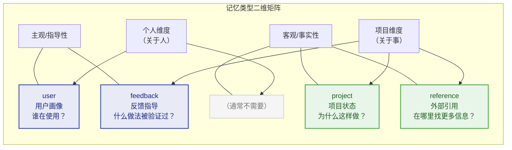
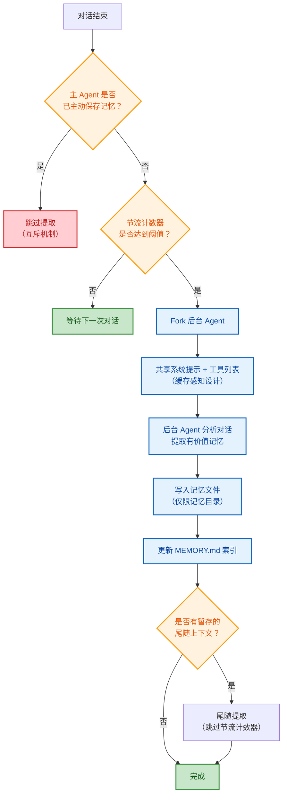
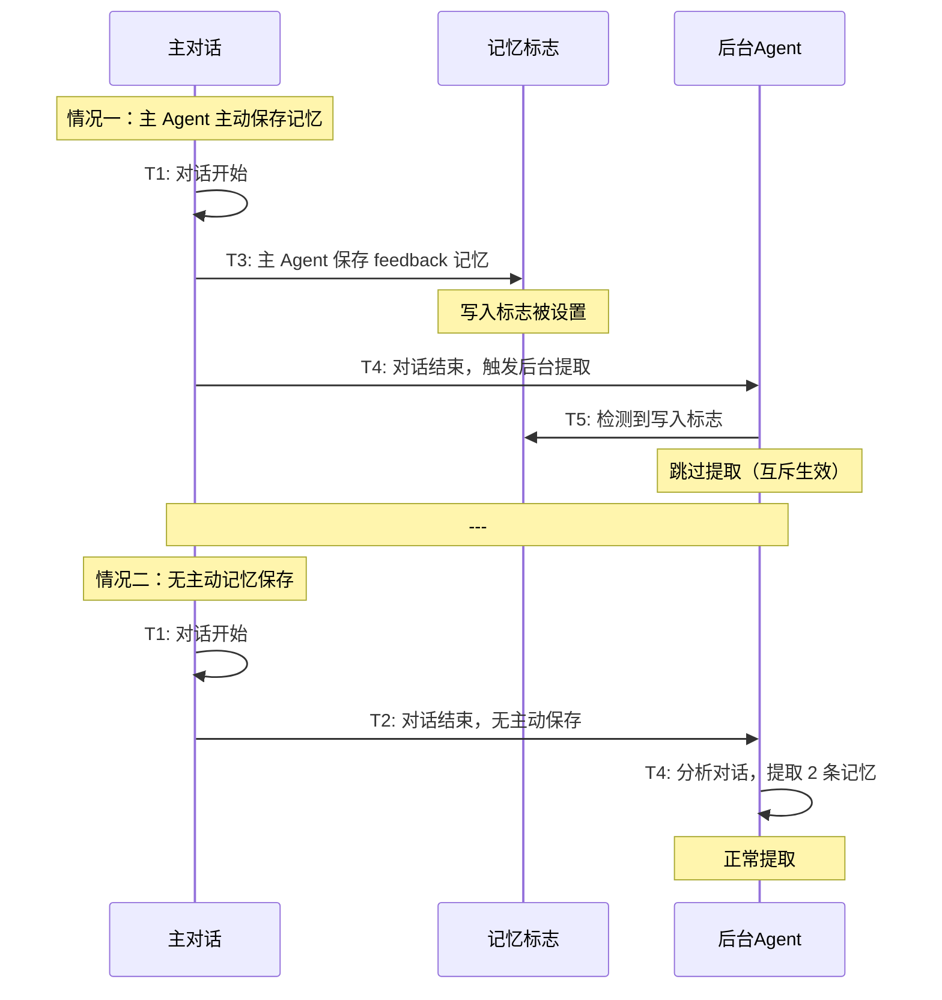
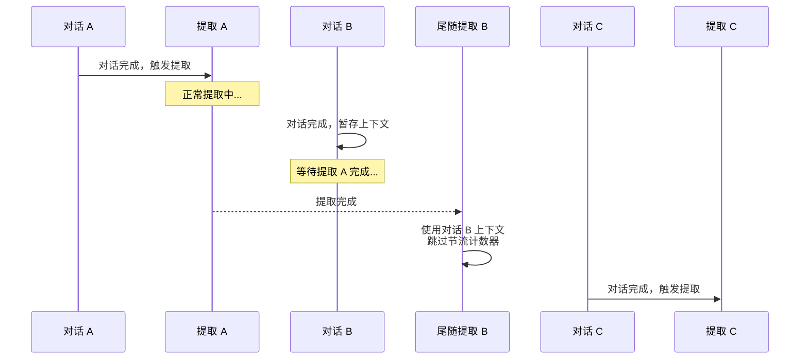
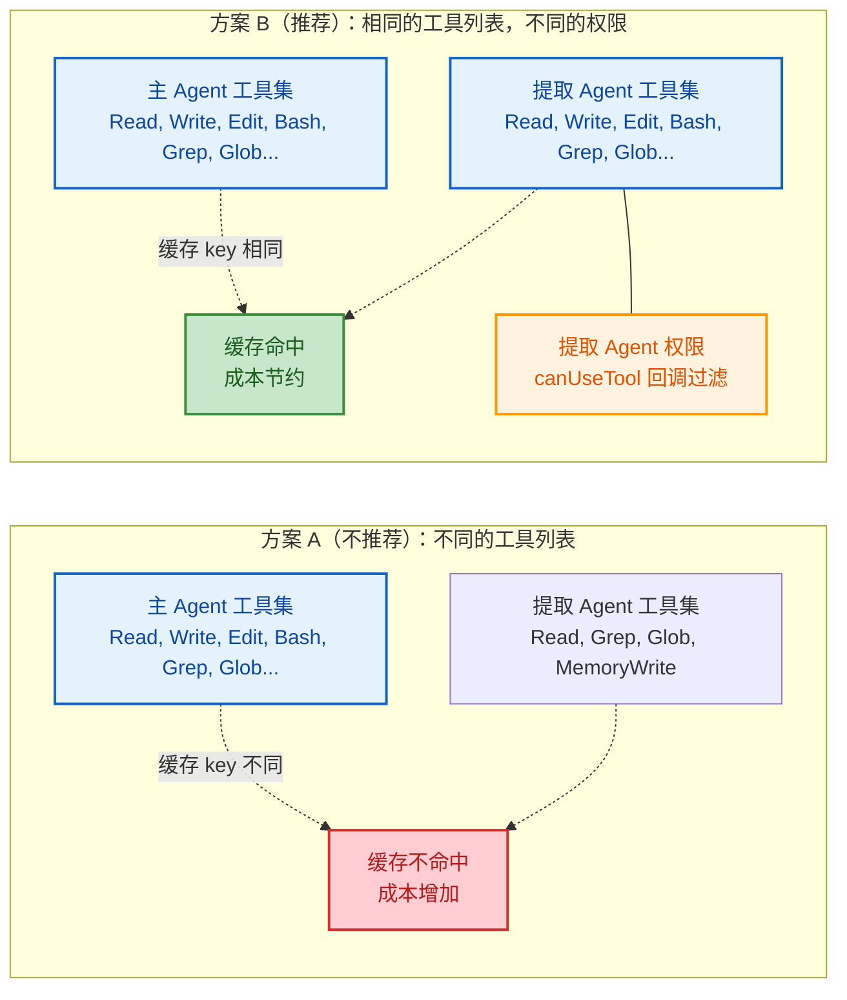
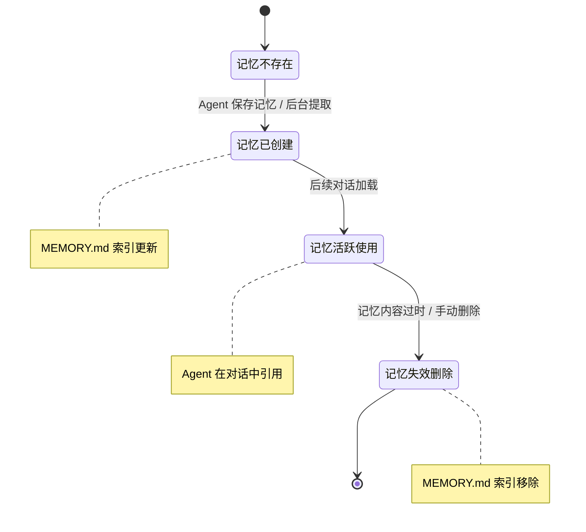
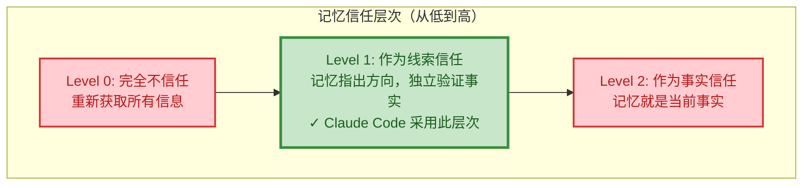

# 第6章：记忆系统 -- Agent 的长期记忆

> **学习目标：** 掌握四种记忆类型的设计意图和自动提取机制，理解基于 Fork 模式的缓存感知架构，学会设计持久化的 Agent 记忆系统。通过本章，你将理解如何利用记忆系统让 Agent 越用越懂你，以及如何在多项目环境中管理记忆的生命周期。

---

人类之所以能够在多次对话中保持连贯，是因为我们有记忆。同样，一个真正有用的 Agent 不能每次对话都从零开始——它需要记住用户是谁、项目在做什么、以及哪些做法被验证过。Claude Code 的记忆系统（memdir）正是为此而生：一个基于文件的、类型化的、跨会话持久的记忆架构。

将记忆系统比作"长期记忆"是生物学上的精确类比。人类的记忆分为感觉记忆（毫秒级）、工作记忆（秒级，对应第7章的上下文管理）和长期记忆（分钟到年，对应本章的记忆系统）。Claude Code 的设计同样遵循这种分层：上下文窗口是"工作记忆"，在一次会话中临时保存信息；而 memdir 是"长期记忆"，跨会话持久保存不可推导的关键知识。

## 6.1 四种记忆类型的分类学

### 6.1.1 闭合类型系统

Claude Code 的记忆被约束为一个闭合的四类型分类系统，定义在记忆类型常量中：user、feedback、project、reference。

这四种类型的设计哲学是：**只保存不可从当前项目状态推导的信息**。代码模式、架构、文件结构和 Git 历史都可以通过工具（grep、git log）实时获取，因此不属于记忆的范畴。

**为什么必须是闭合系统？**

开放类型系统（允许任意自定义类型）看起来更灵活，但在 Agent 场景下有致命缺陷：(1) 类型爆炸——不同用户、不同项目可能创建数十种类型，Agent 在读取时无法高效判断哪些记忆与当前对话相关；(2) 分类模糊——同一条信息可能属于多个自定义类型，导致重复存储；(3) 索引膨胀——MEMORY.md 索引需要为每种类型维护分类逻辑，增加不必要的复杂性。

闭合四类型的设计是一种"约束即自由"的哲学：约束了分类方式，但换来了高效的一致性推理和精确的相关性判断。

### 6.1.2 四种类型的详细解析

四种记忆类型之间的关系可以用一个二维矩阵来理解：



> **user** -- 用户画像

存储用户的角色、目标、知识背景。帮助 Agent 针对不同专业水平的用户调整协作方式——与资深工程师和初学者应该用不同的方式交流。

```
when_to_save: 当了解到用户的角色、偏好、知识背景时
how_to_use:  当需要根据用户画像调整解释深度和协作方式时
```

示例：用户说"我写了十年 Go，但这是第一次接触 React"，Agent 会保存一条 user 类型的记忆，在未来解释前端概念时使用后端类比。

**实际应用场景：**

场景一：跨项目的用户偏好。用户在项目 A 中表达偏好后，Agent 在项目 B 中也能应用相同的偏好。因为 user 类型记忆存储在用户全局目录下，天然支持跨项目共享。

场景二：渐进式了解用户。第一次对话中用户提到自己是数据科学家，Agent 记录为 user 记忆。第五次对话中用户展示了高级 Python 技巧，Agent 更新记忆补充"精通 Python，熟悉 pandas/numpy"。这种渐进式的用户画像构建让 Agent 的协作能力随时间提升。

**feedback -- 反馈指导**

记录用户对 Agent 行为的纠正和确认。这是最重要的记忆类型之一——它让 Agent 在未来的对话中保持行为一致性。

```
when_to_save: 用户纠正你的做法（"不要那样"）或确认非显而易见的做法成功时
body_structure: 规则本身 + Why: 原因 + How to apply: 适用场景
```

关键设计：不仅记录失败（纠正），也记录成功（确认）。如果只保存纠正，Agent 会变得过于谨慎，偏离已被验证的方法。

**实际应用场景：**

场景一：代码风格偏好。用户说"不要用 var，全部使用 const 和 let"，Agent 保存为 feedback 记忆。在后续所有对话中，Agent 生成的代码默认使用 const/let。

场景二：流程要求。用户说"提交代码前必须运行 lint"，Agent 保存为 feedback 记忆。在后续每次执行 git commit 前，Agent 会自动运行 lint 命令。

场景三：反面教训。用户说"上次你直接修改了 package.json 导致版本冲突，以后改依赖先跟我确认"，Agent 保存为 feedback 记忆，在后续修改依赖文件时主动请求确认。

**project -- 项目状态**

记录项目的非代码状态——决策、截止日期、正在进行的工作。代码和 Git 历史是可推导的，但"为什么要这样做"和"什么时候需要完成"这类信息不是。

```
when_to_save: 了解到谁在做什么、为什么做、何时完成时
body_structure: 事实或决策 + Why: 动机 + How to apply: 对建议的影响
```

特别注意：相对日期必须转换为绝对日期（"周四" -> "2026-03-05"），因为记忆是跨会话持久的，相对日期在未来的对话中会失去意义。

**实际应用场景：**

场景一：架构决策记录（ADR）。用户说"认证模块使用 JWT 而非 Session，因为需要支持移动端"，Agent 保存为 project 记忆。当未来需要修改认证相关代码时，Agent 能理解这个决策的背景。

场景二：进行中的工作。用户说"我正在把用户模块从 REST 迁移到 GraphQL，目前完成了查询部分，接下来要做变更部分"，Agent 保存为 project 记忆。在下一次对话中，Agent 能从正确的上下文继续工作。

场景三：团队约定。用户说"我们团队约定所有 API 响应使用 camelCase，但数据库字段使用 snake_case"，Agent 保存为 project 记忆，在生成代码时遵循这个约定。

**reference -- 外部引用**

指向外部系统的指针——Linear 项目、Grafana 仪表盘、Slack 频道。这些信息不在代码仓库中，但对理解项目上下文至关重要。

```
when_to_save: 了解到外部系统的资源和用途时
how_to_use:  当用户引用外部系统或需要查找外部信息时
```

**实际应用场景：**

场景一：监控仪表盘。用户说"生产环境的 Grafana 仪表盘在 https://grafana.company.com/d/abc123"，Agent 保存为 reference 记忆。当用户问"最近有什么异常"时，Agent 能提醒用户查看这个仪表盘。

场景二：文档链接。用户说"API 文档在 Confluence 的 https://confluence.company.com/pages/api-docs"，Agent 保存为 reference 记忆。

场景三：通信渠道。用户说"后端团队的讨论在 #backend-dev Slack 频道"，Agent 保存为 reference 记忆，在需要跨团队协调时提醒用户。

### 6.1.3 明确排除的信息

记忆类型校验模块中明确列出了不应该保存为记忆的内容：

- 代码模式、惯例、架构、文件路径 -- 可以通过阅读代码推导
- Git 历史 -- `git log` / `git blame` 是权威来源
- 调试解决方案 -- 修复已经在代码中，上下文在 commit message 中
- CLAUDE.md 中已有的文档
- 临时任务细节 -- 当前对话的临时状态

甚至当用户**显式要求**保存这些信息时，系统也会引导到更有价值的方向："如果你想保存 PR 列表，请告诉我其中有什么**令人意外**或**非显而易见**的部分——那才是值得保存的。"

**这个排除原则的深层逻辑**

很多用户第一次使用记忆系统时，会试图让 Agent 记住"项目的文件结构"或"API 路由列表"。这种直觉是可以理解的——人类在接手新项目时确实需要了解这些信息。但 Agent 与人类有一个关键区别：Agent 可以在每次对话中实时读取文件系统。

```
信息获取成本对比：

人类开发者:
  记住文件结构 → 几小时的阅读和理解
  下次需要时回忆 → 几秒钟（如果有记忆）
  → 记忆的价值 = 节省的重新阅读时间

Agent:
  实时读取文件结构 → 几毫秒的工具调用
  每次重新获取的成本 → 几百个 token
  → 记忆的价值 ≈ 0（因为实时获取成本极低）
```

因此，记忆系统应该专注于保存"实时获取不到"的信息——人的偏好、决策的背景、外部的链接。这些信息的共同特征是：它们存在于人的大脑或外部系统中，无法通过读取代码仓库获得。

### 6.1.4 记忆使用的最佳实践

**应该保存的记忆（正面案例）：**

| 场景 | 记忆类型 | 保存内容 |
|------|---------|---------|
| 用户表达偏好 | feedback | "用户偏好使用 Vitest 而非 Jest" + Why: 更快的测试执行 |
| 用户纠正行为 | feedback | "不要修改 generated 文件夹中的代码" + Why: 它们由 protoc 自动生成 |
| 架构决策 | project | "使用事件驱动架构而非直接调用" + Why: 服务解耦的需要 |
| 外部系统链接 | reference | "监控告警在 PagerDuty 的 X 服务" |
| 用户背景 | user | "用户是全栈开发者，熟悉 TypeScript 和 Python" |

**不应该保存的记忆（反面案例）：**

| 场景 | 为什么不保存 | 正确做法 |
|------|------------|---------|
| 项目文件列表 | 可通过 `ls` 实时获取 | 无需记忆 |
| API 端点列表 | 可通过读取路由代码获取 | 如果有非显而易见的设计决策，只保存决策 |
| Bug 修复步骤 | 已记录在 commit message 中 | 如果修复涉及反直觉的原因，保存"为什么" |
| 第三方库版本号 | 可通过读取 package.json 获取 | 如果选型有特殊原因，保存原因 |

### 6.1.5 记忆管理的常见误区

**误区一：记忆越多越好**

这是最常见的误区。有些用户会让 Agent 记住所有对话中的细节，导致 MEMORY.md 索引膨胀，记忆目录中堆积大量低价值文件。过多的记忆不仅增加了每次对话的上下文负担，还可能导致 Agent 被"噪音"干扰，忽略真正重要的记忆。

**正确做法**：定期审查记忆目录，删除已过时或低价值的记忆。一个好的记忆应该经得起"如果删除这条记忆，Agent 的行为会有实质性的不同吗？"这个测试。

**误区二：把记忆当作文档系统**

有些用户试图用记忆系统替代项目文档，让 Agent 记住所有的技术规范和设计文档。这违背了"只保存不可推导信息"的原则——技术规范应该放在代码仓库的文档目录中，而非记忆系统中。

**正确做法**：技术文档放在 `docs/` 目录中，架构决策的"为什么"放在记忆中。

**误区三：忽略相对日期问题**

用户说"这个功能下周二上线"，Agent 保存了"下周二上线"。但两天后的下一次对话中，"下周二"变成了"这周二"，再过一周变成了"上周二"。这个记忆不仅无用，还可能误导。

**正确做法**：所有涉及时间的记忆必须使用绝对日期。Agent 应该将"下周二"转换为具体日期（如 2026-04-07）后再保存。

> **交叉引用提示：** 记忆的排除原则与第7章（上下文管理）的压缩策略共享同一种哲学——只保留不可重新获取的信息。上下文压缩会清除旧的工具结果（可以重新执行工具获取），记忆系统会排除代码模式（可以重新阅读代码获取）。

## 6.2 记忆文件格式

### 6.2.1 Frontmatter 格式

每条记忆是一个独立的 Markdown 文件，使用 YAML Frontmatter 声明元数据。格式要求包含 name（记忆名称）、description（一行描述，用于判断未来对话的相关性）和 type（四种类型之一）三个字段。`type` 字段必须是四种类型之一（严格校验），没有 type 字段的遗留文件可以继续工作，但无法被类型过滤。

**为什么使用 Markdown 文件而非数据库？**

这是一个值得分析的架构选择。使用文件系统而非数据库有以下优势：

1. **可读性**：开发者可以直接用文本编辑器查看和编辑记忆文件
2. **版本控制**：记忆文件天然支持 Git 追踪（如果放在项目目录下）
3. **可移植性**：文件系统是最低公共 denominator，无需额外依赖
4. **可调试性**：出现问题时，直接 `ls` 和 `cat` 即可诊断
5. **成本**：无需维护数据库连接、索引、备份

缺点是查询能力有限——无法进行复杂的关联查询或全文搜索。但对于 Agent 的记忆场景，查询模式是简单的"加载所有相关记忆"而非复杂的关联查询，文件系统的能力已经足够。

### 6.2.2 MEMORY.md 索引文件

`MEMORY.md` 是记忆系统的入口点——它不是记忆本身，而是一个索引文件。每次对话开始时，它被自动加载到上下文中，让 Agent 快速了解已有的记忆概况。

记忆目录模块的常量定义了索引的容量限制：索引文件名为 `MEMORY.md`，最多 200 行，最大 25KB。

索引条目的格式要求每条一行，不超过 150 字符：

```markdown
- [Title](file.md) -- 一行钩子描述
```

`truncateEntrypointContent` 函数实现了双重容量保护：先按行截断（200 行上限），再按字节截断（25KB 上限）。超限时，文件末尾会追加一条警告说明哪个上限被触发。

**双重容量保护的设计智慧**

为什么需要两层限制？行数限制和字节限制各有侧重：

- **行数限制（200行）**：保护的是 Agent 的理解效率。即使每行很短，200 行以上的索引也需要 Agent 花费更多 token 来理解和筛选。行数限制确保了索引始终是一个"快速浏览"的工具，而非一个需要"深度阅读"的文档。
- **字节限制（25KB）**：保护的是上下文预算。一条记忆的索引条目可能包含较长的描述（接近 150 字符上限），200 行这样的条目可能达到 30KB，对上下文窗口构成压力。字节限制提供了一个硬性的成本上限。

两层限制的顺序也有讲究——先按行截断再按字节截断。这意味着：当记忆条目较少但描述较长时，字节限制会先触发；当记忆条目较多但描述较短时，行数限制会先触发。无论哪种情况，都有对应的保护机制。

### 6.2.3 记忆文件的目录结构

记忆文件的存储路径由路径解析模块中的函数决定。默认路径为：

```
~/.claude/projects/<sanitized-git-root>/memory/
```

路径解析的优先级：

1. `CLAUDE_COWORK_MEMORY_PATH_OVERRIDE` 环境变量（Cowork 模式的全路径覆盖）
2. `autoMemoryDirectory` 设置（仅限 policySettings/localSettings/userSettings，**projectSettings 被排除**）
3. 默认的 `<memoryBase>/projects/<sanitized-git-root>/memory/`

projectSettings 再次被排除，原因和上一章相同——防止恶意仓库通过 `autoMemoryDirectory: "~/.ssh"` 将写入重定向到敏感目录。路径校验函数对此做了严格的安全检查：拒绝相对路径、根路径、Windows 盘符根、UNC 路径和 null 字节注入。

**路径安全校验的完整防线**

路径校验函数的拒绝列表揭示了攻击者可能尝试的各种路径操纵手段：

| 攻击手段 | 示例 | 防御方式 |
|---------|------|---------|
| 相对路径 | `../../etc/passwd` | 拒绝非绝对路径 |
| 根路径 | `/` | 拒绝根路径 |
| Windows 盘符根 | `C:\` | 拒绝盘符根路径 |
| UNC 路径 | `\\server\share` | 拒绝 UNC 路径 |
| Null 字节注入 | `foo\0.txt` | 拒绝包含 null 字节的路径 |
| 用户目录外 | `/tmp/mem` | 拒绝不在允许的基目录下的路径 |

这些检查层层叠加，形成了一个纵深防御体系。即使某一条检查被绕过，下一条检查仍然可以阻止攻击。

> **交叉引用提示：** projectSettings 排除机制与第5章（设置与配置）的安全边界设计一脉相承。记忆路径的校验是配置系统安全策略的一个具体应用场景。

## 6.3 自动记忆提取

### 6.3.1 基于 Fork 模式的后台提取

记忆提取系统的核心在记忆提取模块中。它不是由主对话直接执行的，而是通过 `runForkedAgent` 在后台运行——一种"完美分叉"模式。

所谓"完美分叉"，是指后台 Agent 与主对话共享完全相同的系统提示（system prompt）和工具集。这意味着：

- 后台 Agent 拥有与主 Agent 相同的上下文理解能力
- 后台 Agent 使用相同的工具集，但受到更严格的权限限制
- **提示缓存（prompt cache）在主对话和后台 Agent 之间共享**

提取的执行时机是在每次完整查询循环结束时（在模型产生最终回复且无工具调用时触发）。



**为什么不在主对话中直接提取记忆？**

这个设计选择涉及多个维度的权衡：

```
主对话直接提取：
  优点 → 实现简单，无进程间通信开销
  缺点 → 增加用户等待时间、消耗主对话的 token 预算、
         提取逻辑的失败可能影响主对话的稳定性

Fork 模式后台提取：
  优点 → 不影响用户体验、独立的 token 预算、
         失败不影响主对话、可以共享缓存降低成本
  缺点 → 实现复杂度更高、需要互斥机制避免重复写入
```

用户体验是最关键的考量。在一次长时间的对话结束时，用户期望立即看到最终结果并开始下一次交互。如果此时还要等待记忆提取完成，即使只是几秒钟的延迟，累积起来也会严重影响交互流畅度。

### 6.3.2 互斥机制

记忆提取模块中的互斥检查函数实现了一个精妙的机制：如果主 Agent 已经在本次对话中写入了记忆文件，则后台提取直接跳过。主对话的 system prompt 中已包含完整的记忆保存指令。当主 Agent 主动保存了记忆时，后台的 forked Agent 会检测到这一事实并跳过本次提取——两者是**互斥**的，避免重复写入。

**互斥机制的实现是一个优雅的"最终一致性"设计。**



这种设计的优势在于避免了"重复提取"导致的冗余记忆。想象一下：如果主 Agent 保存了"用户偏好使用 pnpm"，后台 Agent 又独立分析出"用户偏好使用 pnpm"，同一个信息就产生了两条记忆，既浪费存储空间，又增加了未来筛选的负担。

### 6.3.3 工具权限白名单

后台 Agent 的工具权限通过 `createAutoMemCanUseTool` 函数严格控制：

| 工具 | 权限 | 设计原因 |
|------|------|---------|
| Read / Grep / Glob | 不受限制（只读） | 需要读取代码来理解对话上下文 |
| Bash | 仅限只读命令（ls、find、grep 等） | 需要查看文件状态但不能执行修改命令 |
| Edit / Write | 仅限记忆目录内的路径 | 需要写入记忆文件但不能修改项目代码 |
| REPL | 允许（但内部调用受上述限制） | 可能需要执行代码来验证信息 |
| 其他所有工具 | 拒绝 | 后台 Agent 不应触发网络请求等副作用 |

这个设计使得后台 Agent 拥有足够的读取能力来理解对话内容，但写入能力被限制在记忆目录内——它不能修改项目代码或执行危险命令。

**最小权限原则的完美体现**

工具权限白名单体现了安全设计中的最小权限原则（Principle of Least Privilege）：后台 Agent 只被授予完成其职责所需的最小权限集合。具体来说：

- **为什么允许 Glob？** 后台 Agent 可能需要发现相关文件来验证记忆的准确性（例如，记忆中提到的文件是否还存在）
- **为什么 Bash 限制为只读？** 防止后台 Agent 在用户不知情的情况下执行破坏性命令（如 `rm -rf`）
- **为什么 Edit/Write 限制在记忆目录？** 防止后台 Agent 修改项目代码（这可能改变用户的构建结果或引入 bug）

### 6.3.4 节流与协调

提取不是每次对话都运行的。系统实现了基于计数器的节流机制：每经过若干轮次后才会触发一次提取，通过功能开关配置阈值。

此外，还有一个 **trailing extraction**（尾随提取）机制来处理并发问题。当提取正在进行时又有新的对话完成，新的上下文会被暂存。当前提取完成后，会用最新暂存的上下文运行一次尾随提取。尾随提取跳过节流计数器——它处理的是已经完成的工作，不应该被节流延迟。

**trailing extraction 机制的时序图**



如果没有尾随提取机制，对话 B 的上下文可能永远不会被提取——因为下一次提取时使用的是对话 C 的上下文，对话 B 中可能有独特的、值得记忆的信息被遗漏。

**节流计数器的设计考量**

节流计数器的设计反映了一个成本效益分析：每次记忆提取都需要一次完整的 API 调用（即使有缓存共享，仍然需要支付输出 token 的成本）。对于频繁的短对话（如简单的问答），提取记忆的成本可能超过其价值。节流机制确保了只有在积累了足够的对话轮次后才触发提取，提高了每次提取的"信息密度"。

## 6.4 缓存感知的记忆架构

### 6.4.1 提示缓存共享

在 LLM API 中，提示缓存（prompt cache）是一种重要的成本优化机制——如果两次请求的前缀相同，API 可以复用已计算的 KV cache，显著降低延迟和成本。

Claude Code 的 forked Agent 模式通过 `CacheSafeParams` 类型实现缓存共享。参数提取函数从上下文中提取共享参数，包括系统提示、用户上下文、系统上下文、工具使用上下文和消息历史。

这意味着后台提取 Agent 的 API 请求前缀与主对话完全相同——API 提供商可以命中缓存前缀，避免重新计算。在一个典型的会话中，这可以节省大量 token 消耗。

**缓存共享的成本影响——一个简化的计算**

```
假设：
- 系统提示 + 工具定义 ≈ 30,000 tokens
- 消息历史 ≈ 50,000 tokens（一个中等长度的对话）
- 缓存输入价格 = $0.10 / MTok（缓存命中）
- 标准输入价格 = $3.00 / MTok（无缓存）

无缓存共享：
  提取 Agent 重新发送 80,000 tokens → $0.24

有缓存共享：
  提取 Agent 复用缓存 → $0.008（仅支付缓存读取费用）

节省：96.7%
```

在频繁使用 Agent 的场景下（每天数十次对话），缓存共享带来的成本节约是相当可观的。

### 6.4.2 工具列表的一致性要求

缓存共享有一个隐含约束：**工具列表是 API 缓存 key 的一部分**。如果 forked Agent 使用与主 Agent 不同的工具集，缓存就无法命中。这就是为什么工具权限过滤使用 `canUseTool` 回调而非不同的工具列表——工具列表保持一致，只是执行时被过滤。

**这个设计选择展示了一个重要的架构原则：接口一致，行为可变。**



这个原则不仅适用于记忆系统，也是设计高性能 Agent 架构的一般性指导：尽量保持与缓存相关的接口参数（工具列表、系统提示前缀）不变，将差异化逻辑放在运行时的行为控制中。

### 6.4.3 记忆的生命周期

记忆启用的决策链在路径解析模块中定义：

1. `CLAUDE_CODE_DISABLE_AUTO_MEMORY` 环境变量（1/true -> 关闭）
2. `--bare`（SIMPLE 模式） -> 关闭
3. CCR 无持久存储（无 `CLAUDE_CODE_REMOTE_MEMORY_DIR`） -> 关闭
4. `settings.json` 中的 `autoMemoryEnabled` 字段
5. 默认：启用

后台提取还需要通过 GrowthBook 功能门控。这是双层控制：编译时特性标志加运行时 GrowthBook 实验。

**记忆的生命周期状态机**



记忆的"失效"是一个值得讨论的问题。Claude Code 没有实现自动的记忆过期机制——记忆一旦保存，除非被手动删除或被后续记忆覆盖，否则会一直存在。这意味着记忆的质量管理依赖于 Agent 的判断力（不保存不值得保存的信息）和用户的主动维护。

### 6.4.4 记忆的读取与验证

记忆类型校验模块中定义了记忆读取的核心原则：**记忆是一个时间点的快照，而非当前的事实**。

```
"记忆说 X 存在" 不等于 "X 现在存在"。
```

具体验证规则：

- 如果记忆命名了文件路径：检查文件是否存在
- 如果记忆命名了函数或标志：grep 查找
- 如果用户即将根据你的建议行动（而非询问历史）：先验证

这体现了 Claude Code 的一个深层设计哲学：**记忆是被信任的线索，而非被信任的结论**。它指导 Agent 去哪里找信息，但不替代 Agent 对当前状态的独立验证。

**验证层次的设计哲学**



Claude Code 选择 Level 1 是一种务实的平衡。Level 0 太保守——如果完全不信任记忆，记忆系统就失去了价值。Level 2 太激进——代码仓库的状态可能已经改变，过时的记忆会误导决策。Level 1 让记忆发挥"索引"和"指引"的作用，同时保持对当前状态的独立验证。

这个原则在以下场景中尤为重要：

1. **代码引用**：记忆说"用户认证在 `src/auth/handler.ts` 中"，但文件可能在重构后被移动。Agent 应该先检查文件是否存在，而非直接引用。
2. **依赖版本**：记忆说"项目使用 React 18"，但团队可能已经升级到 React 19。Agent 应该读取 `package.json` 确认当前版本。
3. **决策背景**：记忆说"选择 PostgreSQL 是因为需要复杂查询"，这个决策背景不太会过时——它解释的是"为什么"而非"是什么"，可以直接信任。

> **交叉引用提示：** 记忆验证的"线索而非结论"原则与第7章（上下文管理）中的压缩策略紧密相关。压缩后的摘要同样遵循这个原则——摘要是历史的线索，Agent 应该在必要时验证摘要中提到的当前状态。

---

## 实战练习

### 练习 1：记忆类型分类

以下信息应该保存为哪种记忆类型？

1. "我们团队使用 Linear 项目 'BACKEND' 来追踪后端 Bug"
2. "用户是初级开发者，第一次使用 TypeScript"
3. "集成测试必须使用真实数据库，不要 mock -- 上次 mock 导致生产事故"
4. "认证中间件重写是因为法律合规要求，不是技术债"
5. "API 文档的 Swagger UI 在 http://localhost:3000/api-docs"
6. "每次创建新组件时，先写测试再写实现"

**参考答案**：
1. `reference` -- 外部系统指针
2. `user` -- 用户画像
3. `feedback` -- 行为指导（包含 Why: 生产事故）
4. `project` -- 项目决策（包含 Why: 法律合规）
5. `reference` -- 外部引用（开发环境的 URL）
6. `feedback` -- 行为指导（包含明确的规则和隐含的原因）

### 练习 2：Frontmatter 编写

为以下场景编写记忆文件的 Frontmatter 和内容：

场景：用户说"以后每次提交代码都要先运行 `npm run lint`，上次有人提交了未 lint 的代码导致 CI 失败了一整天"。

**参考答案**：

```markdown
---
name: pre-commit-lint-requirement
description: Must run npm run lint before every commit; CI failed for a full day due to unlinted code
type: feedback
---

**Rule**: Run `npm run lint` before every code commit.

**Why**: A previous commit with unlinted code caused CI to fail for an entire day, blocking the team.

**How to apply**: Before using git commit, always run `npm run lint` first and fix any errors. This applies to all files changed in the commit, not just new files.
```

**延伸思考**：如果用户在一周后说"lint 规则已经集成到 pre-commit hook 中了，不需要手动运行了"，Agent 应该如何处理这条记忆？是删除它，还是更新它？

### 练习 3：缓存感知架构分析

假设你要为 forked Agent 添加一个新工具 `MemorySearch`（用于语义搜索记忆文件）。以下两种方案哪种更好？

- 方案 A：在 forked Agent 的工具列表中新增 `MemorySearch`，替换 `Grep`
- 方案 B：保持工具列表不变，通过 `canUseTool` 权限回调限制 Grep 只能搜索记忆目录

**参考答案**：方案 B 更好。方案 A 改变了工具列表，导致 API 缓存 key 不同，无法共享主对话的提示缓存。方案 B 保持了工具列表的一致性，权限在执行时而非定义时过滤，维护了缓存共享能力。

### 练习 4：记忆管理策略设计

你同时维护 5 个项目，每个项目的记忆目录中都有 20-30 条记忆。设计一个记忆管理策略，解决以下问题：

- 如何避免跨项目的记忆混淆？
- 如何处理已过时的记忆？
- 如何确保 MEMORY.md 索引不超限？

**参考答案提示**：
- 记忆天然按项目隔离（路径基于 Git 根目录），跨项目共享的只有 user 类型记忆
- 定期审查记忆目录，删除经不起"删除后行为是否会改变"测试的低价值记忆
- 控制每条记忆的 description 长度，定期合并主题相近的记忆条目

---

## 关键要点

1. **闭合四类型**：user、feedback、project、reference -- 只保存不可从代码推导的信息，排除代码模式、Git 历史等可推导内容。闭合类型系统换来了高效的一致性推理。
2. **双重容量保护**：MEMORY.md 索引限制 200 行 / 25KB，先按行截断再按字节截断，确保索引始终是"快速浏览"工具而非"深度阅读"文档。
3. **Fork 模式**：后台 Agent 完美分叉主对话，共享提示缓存，通过 `canUseTool` 白名单限制写入权限。不影响用户体验，独立的 token 预算。
4. **互斥提取**：主 Agent 和后台 Agent 的记忆写入是互斥的——主 Agent 写入时后台跳过，避免重复提取导致的冗余记忆。
5. **缓存感知**：工具列表的一致性是缓存共享的前提，权限过滤使用运行时回调而非编译时不同的工具列表。接口一致，行为可变。
6. **验证优先**：记忆是快照而非事实，推荐前必须验证当前状态。"线索而非结论"是使用记忆的正确心态。
7. **最小权限**：后台 Agent 的工具权限白名单严格限制写入能力，体现了最小权限原则。
8. **trailing extraction**：尾随提取机制确保了在提取并发期间不会遗漏任何对话的记忆提取机会。
