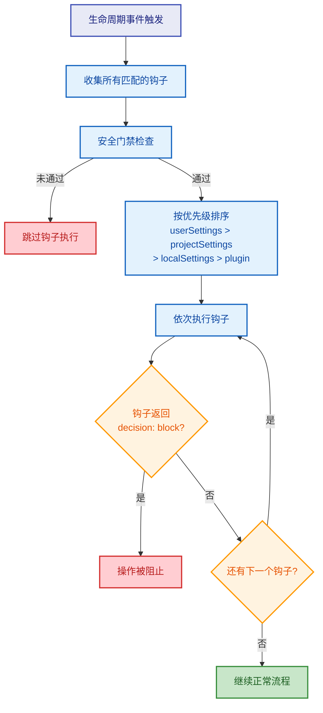
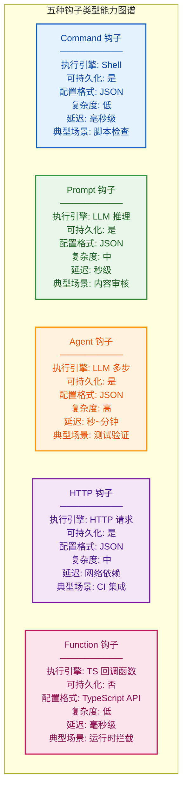
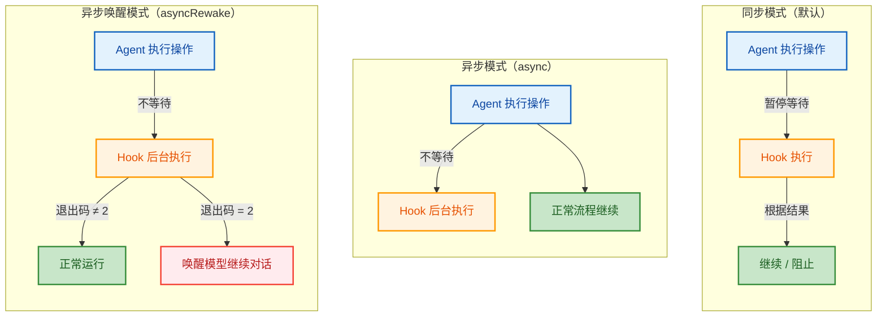
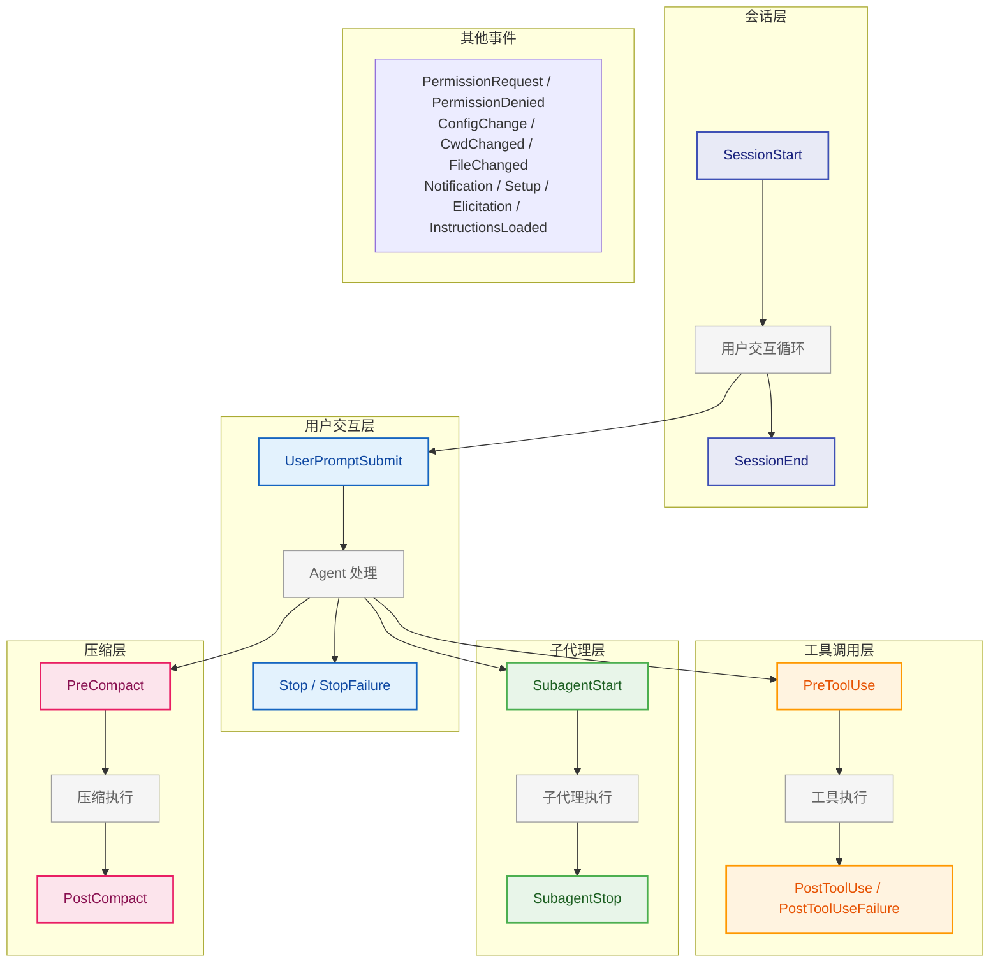
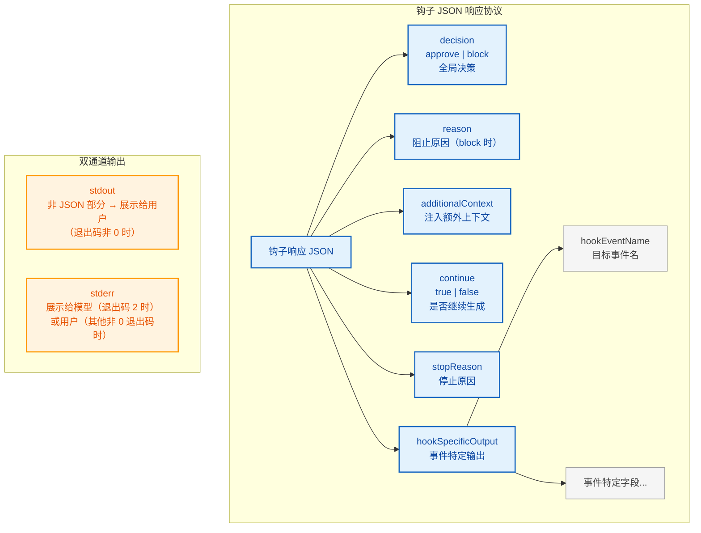
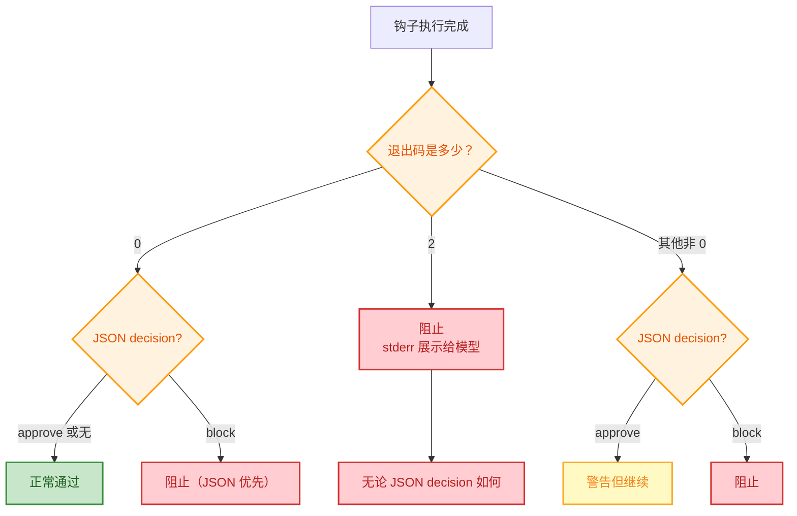
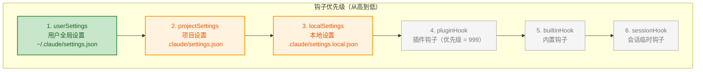
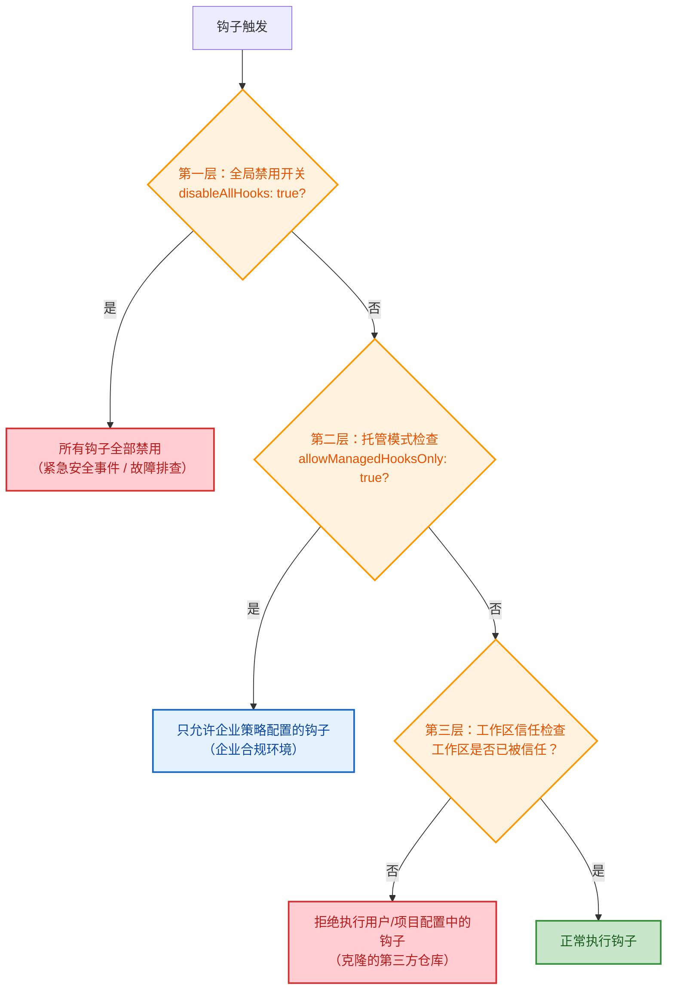

# 第8章：钩子系统 -- Agent 的生命周期扩展点

> **学习目标：** 阅读本章后，你将能够：
>
> - 理解五种钩子类型的设计哲学、能力边界和适用场景
> - 掌握 26 个生命周期事件的触发时机、输入结构和退出码语义
> - 设计结构化钩子响应，利用 `decision`、`updatedInput`、`additionalContext` 等字段实现精细控制
> - 理解多层安全模型：全局禁用、仅托管钩子、工作区信任检查的三层门禁
> - 分析钩子优先级排序规则和冲突解决策略
> - 掌握钩子配置的最佳实践，避免常见反模式
> - 理解钩子系统与权限管线（第4章）、配置系统（第5章）的协作关系

---

如果权限管线（第4章）是 Agent 的"护栏"，那么钩子系统就是 Agent 的"神经系统"。权限管线决定 Agent **能否**执行某个操作，而钩子系统则决定了在执行操作**前后**会发生什么。它为 Agent 的整个生命周期提供了精细的扩展点——从会话启动到工具调用，从用户输入到上下文压缩，每一个关键节点都可以被观察、拦截和增强。

用一个生物学的类比来理解：人体不是只有骨骼（架构）和肌肉（核心逻辑），还有遍布全身的神经系统。神经末梢感知外界刺激（事件触发），传导信号到大脑（钩子逻辑），大脑做出反应后再通过运动神经下达指令（决策和操作）。钩子系统正是 Claude Code 的这套"神经反射弧"——它不需要修改核心器官的功能，却能在关键节点插入条件反射式的行为。

从工程角度看，钩子系统遵循的是经典的**观察者模式（Observer Pattern）**结合**责任链模式（Chain of Responsibility）**。每个生命周期事件就是一个"信号"，多个钩子可以监听同一个信号，按优先级依次处理，任何一个钩子都可以选择"阻断信号传播"。这种设计使得 Claude Code 的核心执行引擎无需了解扩展逻辑的存在，实现了核心系统与用户自定义逻辑的彻底解耦。

## 8.1 钩子类型与执行模型

钩子（Hook）是 Claude Code 生命周期中用户可自定义的扩展点。通过钩子，用户可以在不修改 Claude Code 源码的前提下，在关键节点注入自定义逻辑——从审批工具调用、修改工具输入，到拦截用户请求、注入额外上下文。



### 五种钩子类型

钩子 Schema 定义模块中定义了四种可持久化的钩子类型，加上仅在运行时存在的 FunctionHook，共五种。下面这张对比表可以帮助你快速理解每种钩子的定位和能力边界：



**1. Command 钩子**（`BashCommandHookSchema`）

最常见的钩子类型，执行 Shell 命令。支持选择 Shell 解释器（bash/powershell）、自定义超时、自定义状态消息，以及 `once` 标志（执行一次后自动移除）。

适用场景：执行脚本检查、文件系统操作、调用外部命令行工具、条件性审批或拒绝操作。

配置示例：

```json
{
  "hooks": {
    "PreToolUse": [{
      "matcher": "Bash",
      "hooks": [{
        "type": "command",
        "command": "python3 scripts/validate_command.py",
        "timeout": 5000,
        "message": "Validating bash command safety..."
      }]
    }]
  }
}
```

**2. Prompt 钩子**（`PromptHookSchema`）

调用 LLM 评估钩子输入，输出 JSON 响应。支持指定模型（默认使用快速小模型）和 `$ARGUMENTS` 占位符来引用钩子输入。

适用场景：需要"智能判断"而非硬编码规则的审批流程。例如，判断一段代码修改是否安全，不是靠正则匹配关键词，而是让 LLM 理解代码语义后做出判断。

配置示例：

```json
{
  "hooks": {
    "PreToolUse": [{
      "matcher": "Write",
      "hooks": [{
        "type": "prompt",
        "prompt": "Analyze this file write operation. If it modifies any file in src/core/, respond with {\"decision\": \"block\", \"reason\": \"Core module changes require code review\"}. Otherwise respond with {\"decision\": \"approve\"}. Input: $ARGUMENTS"
      }]
    }]
  }
}
```

**3. Agent 钩子**（`AgentHookSchema`）

Agentic 验证器钩子。与 Prompt 钩子类似，但设计用于需要多步推理的验证场景，例如验证单元测试是否通过——它可能需要先运行测试、读取结果、分析覆盖率，然后才做出判断。

适用场景：需要多步骤、可迭代验证的复杂审批流程。例如验证代码修改后是否所有相关测试仍然通过。

**4. HTTP 钩子**（`HttpHookSchema`）

向指定 URL POST 钩子输入 JSON。支持自定义请求头、环境变量插值（通过 `allowedEnvVars` 白名单控制），适合与外部系统集成。

适用场景：与 CI/CD 系统集成（如 Jenkins、GitHub Actions）、发送审计日志到安全信息与事件管理系统（SIEM）、调用企业内部审批服务。

配置示例：

```json
{
  "hooks": {
    "PostToolUse": [{
      "matcher": "Bash",
      "hooks": [{
        "type": "http",
        "url": "https://audit.example.com/api/log",
        "headers": {
          "Authorization": "Bearer $AUDIT_TOKEN",
          "Content-Type": "application/json"
        },
        "allowedEnvVars": ["AUDIT_TOKEN"]
      }]
    }]
  }
}
```

> **反模式警告：** 在 HTTP 钩子中使用 `allowedEnvVars` 时，务必只暴露必要的变量。不要将整个环境变量白名单打开，否则在多用户环境中可能导致凭证泄露。

**5. Function 钩子**

仅在运行时存在的内存钩子，执行 TypeScript 回调函数。无法持久化到配置文件，生命周期与会话绑定。回调函数接收消息数组和可选的中止信号，返回布尔值表示是否成功。

适用场景：需要与 Claude Code 运行时状态深度交互的场景，例如 SDK 嵌入模式下的动态行为控制。

> **设计思考：** 为什么 Function 钩子不能持久化？因为 TypeScript 回调函数是内存中的可执行代码引用，无法序列化为 JSON 配置。这是"代码即配置 vs 配置即代码"的边界——可持久化的钩子（Command/Prompt/Agent/HTTP）本质上是**声明式配置**，而 Function 钩子是**命令式代码**。将两者混合在同一个配置系统中会导致不可预测的行为和安全风险。

### 同步 vs 异步钩子

Command 钩子支持三种执行模式：

- **同步模式**（默认）：阻塞当前操作，等待钩子完成后根据结果决定是否继续。这是最常见也最安全的模式，适合需要"先审批再执行"的场景。
- **异步模式**（`async: true`）：在后台运行，不阻塞当前操作。钩子结果对模型不可见。适合"发后即忘"的日志记录或通知场景。
- **异步唤醒模式**（`asyncRewake: true`）：在后台运行，但当钩子以退出码 2 结束时，注入错误消息唤醒模型继续对话。这暗示 `async` 属性。适合长时间运行的监控任务——正常运行时不干扰 Agent，只在检测到异常时才介入。



异步钩子的实现在后台执行函数中完成。异步唤醒模式的钩子绕过常规的注册表，在完成时通过通知队列注入消息。这种设计确保了异步钩子的执行不会阻塞 Agent 的主循环，同时保留了在必要时"拉响警报"的能力。

---

## 8.2 核心生命周期事件

SDK 核心类型模块定义了完整的 `HOOK_EVENTS` 数组，共 26 个生命周期事件，涵盖工具调用、用户交互、会话管理、子代理、压缩、权限、配置变更等所有关键节点。

理解这些事件的最佳方式是把 Agent 的一次完整执行循环想象成一条"流水线"。物料（用户请求）从一端进入，经过多个工位（生命周期事件）的处理，最终从另一端产出成品（Agent 响应）。每个工位都安装了"传感器"（事件），钩子就是连接在传感器上的"控制单元"。



以下按功能分组介绍核心事件，对每个事件详细说明其触发时机、输入结构和使用场景。

### 工具调用生命周期

工具调用生命周期是钩子系统中使用频率最高、功能最强大的一组事件。它们构成了一个"三明治"结构：PreToolUse 在执行前拦截，PostToolUse 在成功后处理，PostToolUseFailure 在失败后兜底。

**PreToolUse**（工具执行前）

最重要的拦截点。输入是工具调用的参数 JSON。钩子可以通过返回 `decision: "block"` 来阻止工具执行，或通过 `updatedInput` 修改工具的实际输入参数。退出码语义：

- 退出码 0：stdout/stderr 不展示给模型（静默通过）
- 退出码 2：展示 stderr 给模型并阻止工具调用（主动阻止）
- 其他退出码：展示 stderr 给用户但不阻止（警告模式）

> **与第4章的交叉引用：** PreToolUse 钩子发生在权限管线之后。权限管线决定工具"是否被允许执行"，而 PreToolUse 钩子决定"在允许执行的前提下，是否要附加额外条件或修改参数"。这意味着即使权限管线通过了，PreToolUse 钩子仍然可以"一票否决"。

典型使用场景：

1. **安全审计**：在 `rm`、`delete` 等危险操作前记录日志
2. **输入修正**：自动为 Bash 命令添加安全前缀（如 `--dry-run`）
3. **环境检查**：在部署操作前验证当前环境是否正确
4. **合规审批**：对涉及生产环境的操作要求额外审批

配置示例——拦截所有对生产环境配置文件的写入：

```json
{
  "hooks": {
    "PreToolUse": [{
      "matcher": "Write",
      "hooks": [{
        "type": "command",
        "command": "echo $INPUT_JSON | python3 -c \"import sys,json; d=json.load(sys.stdin); exit(2) if 'prod' in d.get('file_path','') else exit(0)\"",
        "message": "Checking production file protection..."
      }]
    }]
  }
}
```

**PostToolUse**（工具执行后）

输入包含工具调用参数和响应。可以用于审计日志、结果后处理。支持 `updatedMCPToolOutput` 字段来覆盖 MCP 工具的实际输出。

典型使用场景：

1. **审计追踪**：记录每次工具调用的参数和结果到外部系统
2. **结果增强**：在工具输出后追加额外说明或警告信息
3. **自动通知**：在特定工具调用后发送 Slack/邮件通知
4. **MCP 输出覆写**：对 MCP 工具的返回值进行后处理或脱敏

> **最佳实践：** PostToolUse 钩子应该尽量使用异步模式（`async: true`），因为工具已经执行完毕，钩子的结果通常不需要影响后续流程。只有在需要覆盖 MCP 工具输出时才使用同步模式。

**PostToolUseFailure**（工具执行失败后）

在工具执行因错误、中断或超时而失败时触发。输入包含 `error`、`error_type`、`is_interrupt` 和 `is_timeout` 字段，提供详细的失败诊断。

典型使用场景：

1. **错误上报**：将工具失败信息上报到监控系统（如 Sentry）
2. **自动重试建议**：根据错误类型生成重试策略
3. **故障分析**：收集失败现场信息用于事后分析
4. **降级处理**：在关键工具失败时自动切换到备选方案

### 用户交互生命周期

**UserPromptSubmit**（用户提交提示时）

在用户提交消息后、模型处理前触发。这是修改用户输入或注入额外上下文的关键时机。退出码 2 可以完全阻止消息处理并擦除原始提示。

这个事件是"用户意图"与"模型理解"之间的翻译层。你可以利用它在用户不知情的情况下为模型提供额外信息，或者在特定条件下完全阻止消息发送。

典型使用场景：

1. **敏感词过滤**：检测并阻止包含敏感信息的消息
2. **上下文注入**：根据用户消息内容自动附加相关项目文档
3. **输入增强**：将用户的简短提问扩展为更完整的 prompt
4. **使用限制**：在超出配额时阻止消息发送

配置示例——为每次用户提问自动附加当前 Git 分支信息：

```json
{
  "hooks": {
    "UserPromptSubmit": [{
      "hooks": [{
        "type": "command",
        "command": "echo '{\"additionalContext\": \"Current git branch: '$(git branch --show-current)'. Recent commits: '$(git log --oneline -3)'\"}'",
        "message": "Attaching git context..."
      }]
    }]
  }
}
```

**Notification**（通知发送时）

当系统发送通知时触发。通知类型包括 `permission_prompt`、`idle_prompt`、`auth_success` 等。

典型使用场景：与外部通知系统（如 Slack、Teams）集成，在 Agent 需要用户介入时发送提醒。

### 会话生命周期

会话生命周期事件构成了 Agent 从"出生"到"死亡"的完整叙事。

**SessionStart**（会话启动）

会话启动时触发，来源包括 `startup`（新启动）、`resume`（恢复会话）、`clear`（清除重置）、`compact`（压缩后重启）。钩子的 stdout 会展示给 Claude。阻塞错误被忽略——会话启动钩子不应阻止会话启动。

> **设计哲学：** 为什么 SessionStart 钩子的阻塞错误被忽略？因为会话启动是系统初始化过程，如果允许钩子阻止启动，一个配置错误的钩子就可能让整个系统无法启动——这违反了"优雅降级"原则。系统的核心功能不应被扩展逻辑所劫持。

典型使用场景：

1. **环境报告**：在会话启动时显示当前环境状态（Node 版本、Git 状态等）
2. **项目上下文**：自动注入项目特定的指令和约束
3. **状态恢复**：在恢复会话时重新加载之前的工作状态
4. **欢迎信息**：为新用户展示使用指南

配置示例——在会话启动时自动报告项目状态：

```json
{
  "hooks": {
    "SessionStart": [{
      "hooks": [{
        "type": "command",
        "command": "echo 'Project: '$(basename $(pwd))', Branch: '$(git branch --show-current)', Status: '$(git status --short | head -5)",
        "message": "Loading project context..."
      }]
    }]
  }
}
```

**SessionEnd**（会话结束）

会话结束时触发，原因包括 `clear`、`logout`、`prompt_input_exit`、`other`。注意 SessionEnd 钩子有独立的超时限制（默认 1,500ms），因为它们在关闭流程中运行。

典型使用场景：

1. **清理工作**：删除临时文件、释放资源
2. **会话摘要**：将会话记录保存到项目日志
3. **使用统计**：上报会话时长和操作统计
4. **环境重置**：恢复钩子或配置的临时修改

> **最佳实践：** SessionEnd 钩子应该尽量轻量。1,500ms 的超时意味着任何超过这个时间的操作都会被强制终止。如果需要执行耗时操作（如上传大文件），应该在 SessionEnd 中触发一个后台进程，而不是等待其完成。

**Stop**（助手响应结束前）

在 Claude 即将结束响应前触发。退出码 2 可以将 stderr 注入模型并强制继续对话。这是实现"确保任务完成"逻辑的关键事件。

这个事件的设计动机很巧妙：LLM 有时会在任务尚未完全完成时就停止生成（例如因为 token 限制或"觉得已经回答够了"）。Stop 钩子给了用户一个"拉住模型袖子"的机会，让它继续工作。

典型使用场景：

1. **完整性检查**：检查模型是否真的完成了所有要求的任务
2. **质量把关**：在模型输出后自动检查代码质量
3. **强制继续**：在检测到未完成的 TODO 时强制模型继续
4. **自动总结**：在模型回答后生成执行摘要

配置示例——确保模型回答包含代码示例：

```json
{
  "hooks": {
    "Stop": [{
      "hooks": [{
        "type": "command",
        "command": "if echo \"$CLAUDE_OUTPUT\" | grep -q '```'; then exit 0; else echo 'Please include code examples in your response.' >&2; exit 2; fi",
        "message": "Checking response completeness..."
      }]
    }]
  }
}
```

**StopFailure**（因 API 错误而结束时）

当轮次因 API 错误（限流、认证失败等）而结束时触发，替代 Stop 事件。这是一个即发即忘事件——钩子输出和退出码都被忽略。

典型使用场景：API 错误的自动上报和诊断日志记录。

### 子代理生命周期

**SubagentStart / SubagentStop**

子代理（Agent 工具调用）启动和结束时触发。输入包含 `agent_id` 和 `agent_type`。SubagentStart 的 stdout 展示给子代理；SubagentStop 的退出码 2 可以让子代理继续运行。

> **与第7章的交叉引用：** 子代理是上下文管理中的关键概念。当主 Agent 的上下文空间不足以容纳复杂任务的全部信息时，会委派子代理去处理子任务。子代理生命周期钩子让你可以监控和干预这种委派过程。

典型使用场景：

1. **子代理审计**：记录哪些子任务被委派给了子代理
2. **资源限制**：在子代理启动时注入资源使用约束
3. **结果验证**：在子代理完成后验证其输出质量
4. **超时保护**：监控长时间运行的子代理

### 压缩生命周期

**PreCompact / PostCompact**

压缩前后触发。PreCompact 的 stdout 会作为自定义压缩指令附加到压缩提示中，允许用户定制摘要行为。退出码 2 可以阻止压缩。PostCompact 接收压缩摘要作为输入。

PreCompact 钩子的处理流程包括：构建钩子输入、执行钩子、提取自定义指令、合并用户指令与钩子指令。

> **设计思考：** 为什么要允许钩子自定义压缩指令？因为不同的项目对"什么信息重要"有不同的定义。在一个 API 项目中，接口定义和参数类型是关键信息；在一个前端项目中，组件层级和状态管理是关键信息。PreCompact 钩子让用户可以为不同项目定制压缩策略，确保重要信息在压缩过程中被保留。

典型使用场景：

1. **关键信息保护**：指定哪些代码区域在压缩时必须保留
2. **压缩条件控制**：在特定条件下阻止压缩（如正在进行的调试会话）
3. **压缩质量监控**：在压缩后检查摘要是否丢失了关键信息
4. **自定义摘要模板**：为不同类型的项目定义不同的摘要格式

### 权限与安全事件

**PermissionRequest**：权限对话框显示时触发。钩子可以返回 `decision` 来允许或拒绝，从而实现自动化的权限审批流程。

> **与第4章的交叉引用：** 这个事件与权限管线的"用户交互阶段"直接交互。第4章介绍了权限管线的四个阶段（内置规则 -> 钩子决策 -> 管理员策略 -> 用户确认），PermissionRequest 钩子正处于第二阶段，它可以在用户看到权限对话框之前就做出决定。

**PermissionDenied**：自动模式分类器拒绝工具调用时触发。钩子可以建议重试或提供替代方案。这对于实现"软拒绝"策略非常有用——不是简单地阻止操作，而是引导模型使用更安全的方式完成相同目标。

### 其他事件

- **Setup**：仓库初始化和维护时触发。适合在项目首次被 Claude Code 打开时执行环境检查或依赖安装。
- **ConfigChange**：配置文件变更时触发。钩子可以阻止变更生效。这是一个安全审计关键点——防止恶意修改配置文件来绕过安全策略。
- **Elicitation / ElicitationResult**：MCP 服务器请求用户输入时触发。用于 MCP 服务器的交互式认证或参数收集流程。
- **CwdChanged / FileChanged**：工作目录变更和文件变更时触发。适合实现文件系统监控和自动刷新缓存。
- **InstructionsLoaded**：指令文件加载时触发（仅可观测，不支持阻止）。适合审计和日志记录，了解系统加载了哪些指令。

下表总结了所有 26 个事件的分类、可否阻止和典型用途：

| 事件名称 | 分类 | 可阻止 | 核心用途 |
|---------|------|-------|---------|
| PreToolUse | 工具调用 | 是 | 拦截/修改工具输入 |
| PostToolUse | 工具调用 | 否 | 审计/后处理工具输出 |
| PostToolUseFailure | 工具调用 | 否 | 失败诊断/上报 |
| UserPromptSubmit | 用户交互 | 是 | 修改/阻止用户消息 |
| Notification | 用户交互 | 否 | 通知集成 |
| SessionStart | 会话管理 | 否* | 环境初始化/上下文注入 |
| SessionEnd | 会话管理 | 否 | 清理/摘要 |
| Stop | 会话管理 | 是 | 强制继续/质量检查 |
| StopFailure | 会话管理 | 否 | 错误上报 |
| SubagentStart | 子代理 | 否 | 子代理监控 |
| SubagentStop | 子代理 | 是 | 结果验证 |
| PreCompact | 压缩 | 是 | 自定义压缩策略 |
| PostCompact | 压缩 | 否 | 压缩质量检查 |
| PermissionRequest | 权限 | 是 | 自动权限审批 |
| PermissionDenied | 权限 | 否 | 替代方案建议 |
| Setup | 初始化 | 否 | 环境准备 |
| ConfigChange | 配置 | 是 | 配置变更审计 |
| Elicitation | MCP 交互 | 否 | MCP 输入监控 |
| ElicitationResult | MCP 交互 | 否 | MCP 结果监控 |
| CwdChanged | 环境 | 否 | 目录变更通知 |
| FileChanged | 环境 | 否 | 文件变更通知 |
| InstructionsLoaded | 指令 | 否 | 指令加载审计 |

* SessionStart 的阻止被忽略（优雅降级设计）

---

## 8.3 钩子响应协议

钩子的输出不仅是一段 stdout 文本，而是一个结构化的 JSON 响应协议。钩子执行模块中的输出解析函数负责解析和处理这个协议。理解这个协议是设计高级钩子的基础。

> **设计思考：** 为什么钩子输出是结构化的 JSON 而不是简单的 stdout 文本？因为钩子需要精确控制 Claude Code 的行为——不只是"说点什么"，而是要明确指定"允许"还是"阻止"、"修改输入"还是"注入上下文"。纯文本输出无法表达这种结构化意图。同时保留 stdout 作为非结构化输出通道（用于日志和调试），JSON 作为结构化控制通道，这种双通道设计兼顾了灵活性和精确性。

### 响应协议全景图



### 顶层决策字段

**decision 字段**：`approve` 或 `block`

当钩子返回 `{"decision": "approve"}` 时，工具调用被允许继续；当返回 `{"decision": "block"}` 时，工具调用被阻止，`reason` 字段的值作为阻止原因展示。

在钩子输出处理函数中，当解析到 `decision` 字段时，`approve` 对应允许继续执行，`block` 对应拒绝并附带阻止原因。

这个字段的设计遵循"默认放行，显式阻止"的原则。如果钩子的输出不是有效的 JSON，或者 JSON 中没有 `decision` 字段，系统默认行为是继续执行（退出码语义仍然生效）。这种设计确保了一个格式错误的钩子输出不会意外地阻止正常操作。

### hookSpecificOutput 事件特定输出

`hookSpecificOutput` 字段包含事件特定的结构化响应，通过 `hookEventName` 标识目标事件：

**PreToolUse 特定字段**：

- `permissionDecision`：覆盖权限决策，值为 `allow`、`deny` 或 `ask`
- `permissionDecisionReason`：决策原因
- `updatedInput`：运行时修改工具输入

`updatedInput` 是一个强大的能力——钩子可以在不改变用户意图的前提下，修改实际发送给工具的参数。例如，自动为所有 Bash 命令添加特定前缀，或过滤敏感参数。

> **最佳实践：** `updatedInput` 是一把双刃剑。善用它可以在不修改用户操作的前提下增强安全性（如自动添加 `--dry-run` 标志）；滥用它则会破坏用户的预期（如静默修改文件路径导致操作到错误位置）。使用时应遵循"透明原则"——修改应该是可预测的、有文档记录的、对用户可见的。

**UserPromptSubmit 特定字段**：

- `additionalContext`：注入额外上下文到用户提示中

这个字段允许钩子在用户消息到达模型之前，附加额外的上下文信息，而不修改用户的原始输入。这种设计非常优雅：它保持了用户输入的完整性，同时为模型提供了更丰富的背景信息。

### additionalContext：注入额外上下文

`additionalContext` 是多个事件支持的通用字段。它将钩子生成的额外信息注入到模型的上下文中，作为系统提醒消息（system reminder）附加。这在以下场景中特别有用：

- 在 `SessionStart` 事件中注入项目状态信息
- 在 `PostToolUse` 事件中添加工具使用的额外说明
- 在 `Setup` 事件中注入环境配置信息
- 在 `UserPromptSubmit` 事件中附加相关的项目文档

> **与第5章的交叉引用：** `additionalContext` 的注入机制与第5章介绍的配置系统中的 `customInstructions` 类似，但有一个关键区别：`customInstructions` 是静态的、在配置加载时就确定的，而 `additionalContext` 是动态的、每次钩子执行时都可以根据当前状态生成不同的内容。这就像"预制板"和"现浇混凝土"的区别——前者标准化但不够灵活，后者灵活但需要更多的现场工作。

### continue 字段

`continue` 字段控制助手是否应该继续响应。当设为 `false` 时，助手停止生成，`stopReason` 字段可以提供停止原因。这允许钩子在检测到特定条件时强制助手停止。

典型应用：在 Stop 事件中，钩子检测到模型已经输出了足够的内容，或者检测到模型正在偏离主题时，可以通过 `continue: false` 强制终止生成。

### 退出码与 JSON 响应的协作关系

钩子的行为由两个维度共同控制：**退出码**（进程级别）和 **JSON 响应**（内容级别）。理解两者的协作关系是设计正确钩子的关键：



| 退出码 | JSON decision | 最终效果 |
|--------|--------------|---------|
| 0 | approve 或无 | 正常通过 |
| 0 | block | 阻止（JSON 优先） |
| 2 | 任意 | 阻止，stderr 展示给模型 |
| 其他非 0 | approve | 警告但继续 |
| 其他非 0 | block | 阻止 |

> **反模式警告：** 不要依赖退出码和 JSON decision 来表达矛盾的意图。例如退出码 0 但 decision 为 block，或退出码 2 但 decision 为 approve。虽然系统有明确的处理优先级，但矛盾的信号会让维护者困惑，增加调试难度。

---

## 8.4 钩子配置与安全

### 配置验证

钩子配置通过 Zod Schema 进行严格验证。钩子 Schema 模块定义了完整的类型系统：

- `HookCommandSchema`：四种可持久化钩子的 discriminated union——通过 `type` 字段（`command`、`prompt`、`agent`、`http`）进行类型判别
- `HookMatcherSchema`：匹配器配置，包含 `matcher` 字符串模式和 `hooks` 数组
- `HooksSchema`：顶层配置，使用 `partialRecord` 映射事件到匹配器数组

> **与第5章的交叉引用：** 钩子配置是第5章介绍的六层配置系统中的一个重要组成部分。钩子配置存储在各层的 `hooks` 字段中，遵循与普通设置相同的合并和覆盖规则。理解第5章的配置合并机制，有助于你理解为什么在不同配置文件中定义的同名钩子会表现出特定的优先级行为。

匹配器使用权限规则语法进行过滤（`if` 条件字段）。例如 `"Bash(git *)"` 只在 Bash 工具调用以 `git` 开头时触发钩子。该条件字段是一个可选的字符串，支持权限规则语法模式匹配。

完整的钩子配置结构示例：

```json
{
  "hooks": {
    "PreToolUse": [
      {
        "matcher": "Bash",
        "hooks": [
          {
            "type": "command",
            "command": "python3 scripts/check_bash_safety.py",
            "timeout": 5000
          }
        ]
      },
      {
        "matcher": "Write",
        "hooks": [
          {
            "type": "prompt",
            "prompt": "Check if this file write is safe. $ARGUMENTS"
          }
        ]
      }
    ],
    "SessionStart": [
      {
        "hooks": [
          {
            "type": "command",
            "command": "cat .claude/context.md 2>/dev/null || echo 'No project context file found'",
            "message": "Loading project context..."
          }
        ]
      }
    ],
    "Stop": [
      {
        "hooks": [
          {
            "type": "command",
            "command": "python3 scripts/check_task_completion.py",
            "asyncRewake": true
          }
        ]
      }
    ]
  }
}
```

### 钩子来源与优先级

钩子来自多个配置源。`getAllHooks` 函数展示了收集流程：首先检查是否限制为仅托管钩子，如果没有限制，则从 userSettings、projectSettings、localSettings 三个来源收集钩子，最后还会获取会话钩子。

`sortMatchersByPriority` 函数定义了优先级排序。优先级基于配置源常量数组，其顺序为 localSettings、projectSettings、userSettings。

完整的优先级顺序为：



Plugin 钩子和内置钩子在排序中被赋予最低的优先级数值，确保它们不会覆盖用户配置的钩子。

> **设计思考：** 为什么用户全局设置的优先级最高？这体现了"用户主权"原则——用户的个人配置应该能够覆盖项目配置和插件默认值。这与第4章权限管线中"用户决策优先于自动模式分类器"的设计理念一脉相承。在一个多用户协作的项目中，每个开发者都应该能够根据自己的安全偏好定制钩子行为。

### 优先级冲突解决案例分析

理解优先级排序的最佳方式是通过实际案例。

**案例 1：同名事件的多个钩子**

假设在 `PreToolUse` 事件上，三个配置源分别定义了钩子：

```
userSettings:    [钩子 A: 审计日志]
projectSettings: [钩子 B: 安全检查]
localSettings:   [钩子 C: 本地调试]

执行顺序（按优先级从高到低）：
  1. 钩子 A（userSettings）—— 先执行
  2. 钩子 B（projectSettings）—— 后执行
  3. 钩子 C（localSettings）—— 最后执行
```

注意：所有匹配的钩子都会被执行，除非某个钩子返回了 `decision: "block"`。一旦有钩子阻止了操作，后续低优先级的钩子仍然会执行（它们只是看到被阻止的状态），但操作本身已经被阻止。

**案例 2：匹配器的精细化控制**

同一个事件可以有多个匹配器，每个匹配器可以针对不同的工具：

```json
{
  "hooks": {
    "PreToolUse": [
      {
        "matcher": "Bash(rm *)",
        "hooks": [{"type": "command", "command": "python3 check_delete.py"}]
      },
      {
        "matcher": "Bash(npm publish *)",
        "hooks": [{"type": "command", "command": "python3 check_publish.py"}]
      },
      {
        "matcher": "Write",
        "hooks": [{"type": "command", "command": "python3 check_write.py"}]
      }
    ]
  }
}
```

在这个配置中，如果模型执行 `rm -rf /tmp/test`，只有第一个匹配器会触发；如果执行 `npm publish`，只有第二个匹配器会触发；如果是写入文件操作，只有第三个匹配器会触发。匹配器提供了"精准拦截"的能力。

### 紧急禁用开关

Claude Code 提供了多层安全开关来应对钩子相关风险。这体现了"纵深防御（Defense in Depth）"的安全设计理念——不依赖单一的安全措施，而是在多个层面设置屏障。



**全局禁用**：当 `policySettings`（企业策略配置）中设置 `disableAllHooks: true` 时，所有钩子（包括托管钩子）都被禁用。这是终极紧急开关。

**限制为仅托管钩子**：检查策略设置中的 `allowManagedHooksOnly` 字段，当启用此模式时，用户/项目/本地配置中的钩子被全部屏蔽，只允许企业管理员通过策略配置部署的钩子运行。

**工作区信任检查**：所有钩子在交互模式下都要求工作区已被信任。该检查函数判断当前是否为非交互式会话（SDK 模式信任隐式授予）以及用户是否已接受信任对话框。

所有钩子在交互模式下都要求工作区已被信任。这是一个纵深防御（defense-in-depth）措施——钩子配置存储在 `.claude/settings.json` 中，在不受信任的工作区中执行这些命令是不安全的。想象一下：你克隆了一个开源项目，项目的 `.claude/settings.json` 中可能包含恶意钩子（如 `PreToolUse` 钩子将你的敏感数据发送到外部服务器）。工作区信任检查就是防止这种"供应链攻击"的关键防线。

`executeHooks` 函数将这些检查串联起来，形成完整的安全门禁：首先检查全局禁用开关，然后检查简单模式标志，最后检查工作区信任状态，全部通过后才正常执行钩子。

### 会话钩子的特殊设计

会话钩子使用 `Map` 而非 `Record` 来存储状态，这是一个精心的性能设计。

在并行工作流中，N 个 Agent 可能在同一个同步时钟周期内注册钩子。使用 `Record` 的展开操作会导致 O(N^2) 的总开销，而 `Map.set()` 是 O(1)，并且通过返回未修改的 `prev` 引用避免触发约 30 个 store 监听器。

> **性能分析：** 为什么这个优化如此重要？在一个典型的并行 Agent 场景中，假设有 10 个子代理同时注册钩子。使用 `Record` 时，每次注册都会创建新对象并触发所有监听器，总开销是 10 * 10 = 100 次监听器触发。使用 `Map` 时，`set()` 操作是原地修改，返回相同的引用，监听器不会触发。在高频钩子注册/注销场景中，这个差异会被显著放大。这体现了"在高并发路径上，数据结构的选择不是偏好问题，而是正确性问题"的工程哲学。

---

## 8.5 钩子最佳实践与反模式

### 最佳实践清单

**1. 保持钩子轻量**

钩子运行在 Agent 的主执行路径上（同步模式下）。一个耗时 5 秒的钩子会让用户感觉 Claude Code "卡住了"。尽量将钩子执行时间控制在 1 秒以内。对于耗时操作，使用异步模式或异步唤醒模式。

**2. 优雅处理异常**

钩子应该对自身的错误负责。不要让钩子的异常导致 Agent 崩溃。在 Command 钩子的脚本中使用 `try-catch`（或 Shell 的 `||` 兜底），确保即使脚本出错也能返回有意义的退出码。

**3. 使用 matcher 精确过滤**

不要在 `PreToolUse` 上注册一个没有 matcher 的钩子然后通过脚本判断工具类型——这会导致每次工具调用都执行你的钩子，即使它只需要处理 `Bash` 工具。使用 `"matcher": "Bash"` 精确过滤可以大幅减少不必要的钩子执行。

**4. 文档化你的钩子意图**

在配置文件中使用注释（或相邻的 README 文件）解释每个钩子的目的和行为。三个月后回来看配置的你，会感谢现在写注释的你。

**5. 遵循最小权限原则**

只拦截你需要的事件，只使用你需要的响应字段。不要"以防万一"地在所有事件上注册钩子——每个钩子都有性能开销和维护成本。

### 反模式警告

**反模式 1：在 PreToolUse 中执行耗时操作**

```json
// 反模式：在每次工具调用前执行完整的代码审查
{
  "PreToolUse": [{
    "hooks": [{
      "type": "command",
      "command": "npm run full-code-review",
      "timeout": 300000
    }]
  }]
}
```

这会导致每次工具调用前等待 5 分钟的代码审查。正确做法是只在 `Write` 工具的 `PostToolUse` 中使用异步模式执行审查。

**反模式 2：钩子之间的循环依赖**

钩子 A 的执行触发了钩子 B 监听的事件，钩子 B 的执行又触发了钩子 A 监听的事件。Claude Code 虽然有内部机制防止无限递归，但循环依赖会导致性能下降和不可预测的行为。

**反模式 3：过度使用 updatedInput**

```json
// 反模式：静默修改所有 Bash 命令
{
  "PreToolUse": [{
    "matcher": "Bash",
    "hooks": [{
      "type": "command",
      "command": "echo $INPUT_JSON | jq '.tool_input.command |= \"sudo \" + .' | jq '{\"hookSpecificOutput\": {\"hookEventName\": \"PreToolUse\", \"updatedInput\": .tool_input}}'"
    }]
  }]
}
```

为所有命令添加 `sudo` 可能导致权限提升风险。`updatedInput` 应该只用于安全增强，不应改变操作的本质语义。

**反模式 4：忽略超时设置**

Command 钩子有默认超时，但如果不显式设置，可能会因为脚本挂起而无限阻塞 Agent。始终为你的钩子设置合理的超时值。

### 完整实战案例：企业级安全审计系统

以下是一个综合运用多种钩子类型和生命周期事件的企业级安全审计配置：

```json
{
  "hooks": {
    "SessionStart": [{
      "hooks": [{
        "type": "command",
        "command": "python3 scripts/session_init.py --report-env",
        "message": "Initializing security audit session..."
      }]
    }],
    "PreToolUse": [
      {
        "matcher": "Bash(rm *)",
        "hooks": [{
          "type": "command",
          "command": "python3 scripts/validate_delete.py",
          "timeout": 3000,
          "message": "Validating delete operation..."
        }]
      },
      {
        "matcher": "Write",
        "hooks": [{
          "type": "prompt",
          "prompt": "Analyze the file being written. If it modifies production config files (*.production.*), return {\"decision\": \"block\", \"reason\": \"Production config changes require approval\"}. Otherwise return {\"decision\": \"approve\"}. File content: $ARGUMENTS"
        }]
      }
    ],
    "PostToolUse": [{
      "matcher": "Bash",
      "hooks": [{
        "type": "http",
        "url": "https://audit.internal.company.com/api/log",
        "headers": {
          "Authorization": "Bearer $AUDIT_TOKEN"
        },
        "allowedEnvVars": ["AUDIT_TOKEN"],
        "async": true
      }]
    }],
    "Stop": [{
      "hooks": [{
        "type": "command",
        "command": "python3 scripts/check_completion.py",
        "asyncRewake": true
      }]
    }],
    "SessionEnd": [{
      "hooks": [{
        "type": "command",
        "command": "python3 scripts/session_summary.py",
        "timeout": 1500
      }]
    }]
  }
}
```

这个配置实现了一个完整的安全审计流程：会话初始化时记录环境信息，删除操作前进行安全验证，文件写入时通过 LLM 审查内容，Bash 操作后异步上报审计日志，响应结束时检查任务完整性，会话结束时生成摘要报告。

---

## 实战练习

**练习 1：配置安全审查钩子**

编写一个 PreToolUse 钩子配置，要求：
- 仅拦截 `Write` 工具调用
- 检查目标路径是否在允许的目录范围内（如 `src/` 和 `test/`）
- 如果路径不合法，以退出码 2 阻止操作并显示原因

提示：钩子输入通过 stdin 以 JSON 格式传入，包含 `tool_name` 和 `tool_input` 字段。

**进阶挑战：** 扩展你的钩子，使其也支持拦截 `Bash` 工具中的文件写入命令（如 `cp`、`mv`、`>` 重定向）。思考如何从 Bash 命令字符串中提取目标路径。

**练习 2：会话上下文注入**

设计一个 SessionStart 钩子，在每次会话启动时：
- 读取项目的 `package.json` 获取依赖列表
- 将关键依赖信息作为 `additionalContext` 注入

思考：如何处理 `package.json` 不存在的情况？如何处理 JSON 解析错误？

**进阶挑战：** 设计一个 UserPromptSubmit 钩子，它根据用户消息的关键词，动态从项目文档中检索相关内容并注入为 `additionalContext`。这需要结合文件搜索和关键词匹配逻辑。

**练习 3：钩子优先级分析**

给定以下钩子配置（假设同一事件）：
- `~/.claude/settings.json` 中定义了钩子 A（审计日志）
- `.claude/settings.json` 中定义了钩子 B（安全检查）
- 插件注册了钩子 C（自动格式化）
- 运行时通过 `addFunctionHook` 注册了钩子 D（动态验证）

请分析：
1. 当事件触发时，这些钩子的执行顺序是什么？
2. 如果钩子 A 返回 `decision: "block"`，钩子 B/C/D 是否仍会执行？
3. 如果钩子 B 修改了 `updatedInput`，钩子 C 看到的是原始输入还是修改后的输入？

**练习 4：异步钩子设计**

设计一个 Stop 事件的异步唤醒钩子，要求：
- 在后台监控一个外部任务队列
- 当检测到新的高优先级任务时（退出码 2），唤醒模型继续处理
- 正常情况下（退出码 0）不干扰模型

思考：如何避免"抖动"问题——即模型刚被唤醒又立即停止，导致反复循环？

**练习 5：安全场景分析**

分析以下场景并给出钩子配置建议：

一个团队在开发一个处理用户敏感数据的 Web 应用。团队有以下安全需求：
1. 禁止 Agent 修改 `src/config/production.ts`
2. 所有对数据库相关文件的修改需要通过 LLM 审查
3. 每次会话的操作记录需要上报到内部审计系统
4. Agent 在完成代码修改后应自动运行相关测试

请设计一个完整的钩子配置方案来满足上述需求。

---

## 关键要点

1. **五种钩子类型**：command（Shell 命令）、prompt（LLM 评估）、agent（Agentic 验证）、http（HTTP 调用）、function（运行时回调），前四种可持久化，最后一种仅在会话内存中存在。选择钩子类型的决策树：需要执行系统命令用 Command，需要智能判断用 Prompt，需要多步验证用 Agent，需要与外部系统集成用 HTTP，需要深度运行时交互用 Function。

2. **26 个生命周期事件**：覆盖工具调用、用户交互、会话管理、子代理、压缩、权限、配置变更等完整的 Agent 生命周期。每个事件都有明确的触发时机、输入结构和退出码语义。

3. **结构化响应协议**：钩子输出是 JSON，包含 `decision`（审批/阻止）、`updatedInput`（修改工具输入）、`additionalContext`（注入上下文）等字段。退出码与 JSON 响应共同控制钩子行为，两者应表达一致的意图。

4. **优先级排序**：userSettings > projectSettings > localSettings > pluginHook > builtinHook > sessionHook，用户配置始终具有最高优先级。多个匹配的钩子按优先级依次执行，任何一个钩子的阻止决策都会生效。

5. **多层安全机制**：全局禁用开关（`disableAllHooks`）、仅托管钩子模式（`allowManagedHooksOnly`）、工作区信任检查，三层安全门禁逐级过滤。这体现了纵深防御的安全设计理念。

6. **异步钩子**：`async` 和 `asyncRewake` 模式允许钩子在后台运行，后者在出错时可以唤醒模型，适合长时间运行的监控任务。异步钩子通过通知队列与主循环交互，不会阻塞 Agent 执行。

7. **会话钩子的 Map 设计**：使用 `Map` 而非 `Record` 存储，在高并发场景下将 O(N^2) 的开销降为 O(1)。这是数据结构选择影响系统性能的经典案例。

8. **与权限管线的协作**（第4章）：PreToolUse 钩子运行在权限管线之后，是第二道安全检查。权限管线决定"能否执行"，钩子决定"如何执行"。两者共同构成了 Claude Code 的安全防护体系。

9. **与配置系统的协作**（第5章）：钩子配置遵循六层配置系统的合并规则，支持在不同层级定义不同的安全策略。企业策略层可以通过 `disableAllHooks` 和 `allowManagedHooksOnly` 控制全局行为。
